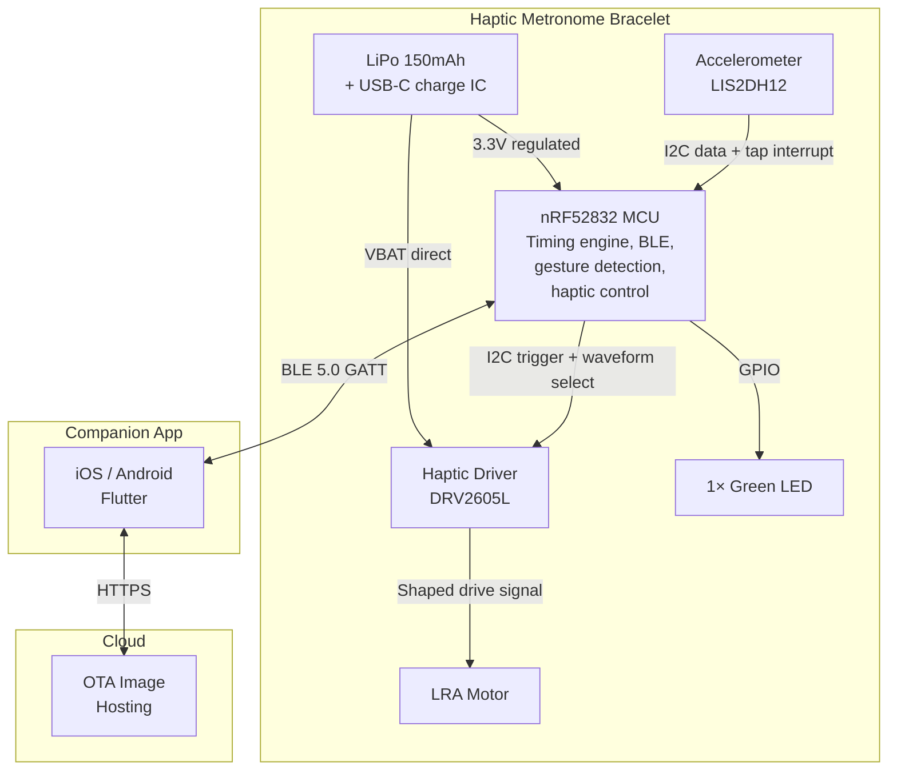
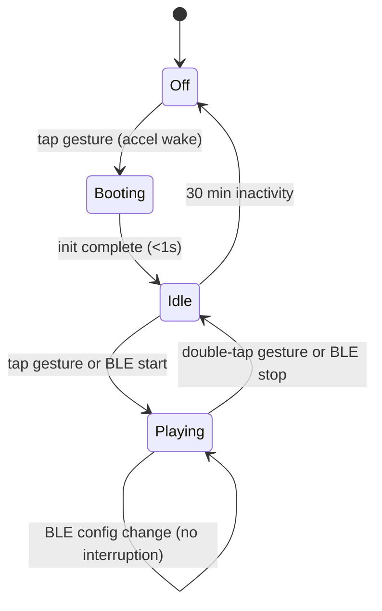

# System Description: Haptic Metronome Bracelet

| Field | Value |
|-------|-------|
| Version | 0.1 |
| Date | 2026-02-22 |
| Author | |
| Status | Draft |
| Related docs | explore_notes.md, high_level_design.md |

---

## 1. Product Vision and Context

**Product statement:**
For practicing and performing musicians, the Haptic Metronome Bracelet is a wrist-worn device that delivers precise vibrotactile beat pulses — silent, private, and felt through the skin. Unlike phone metronome apps or audible click tracks, it keeps time without producing sound, letting the musician feel the beat without disrupting an audience, ensemble, or practice environment.

**Problem:**
Audible metronomes are unusable during performance, distracting during quiet practice, and inaudible through headphones in loud rehearsal settings. Phone vibration is too slow and imprecise for musical time. Earpiece click tracks isolate the musician from the room. Musicians need a time reference that is private, precise, and doesn't occupy an ear or produce sound. Vibrotactile pulse on the wrist solves all three: it's silent, sub-millisecond precise, and leaves both ears open.

**Deployment context:**
- Environment: Indoor and outdoor (practice rooms, stages, rehearsal halls, outdoor gigs)
- Setting: Home practice, ensemble rehearsal, live performance
- User type: Consumer — guitarists, pianists, string players, wind/brass players, vocalists, conductors, music students. Not targeted at drummers/percussionists (who typically set the time rather than follow it).
- Installation: None — wear on wrist
- Expected lifespan: 3–5 years (hardware); ongoing app updates

---

## 2. User Scenarios

### Scenario 1: Solo Practice — Pianist
**Persona:** Sofia, 24, jazz piano student. Practices 3 hours daily, works on rhythmic independence.
**Situation:** Sofia opens the companion app, sets 92 BPM in 3/4 for a waltz exercise. She taps the bracelet on her left wrist with her right hand.
**Action:** The bracelet begins pulsing. Beat 1 is a distinct dual-pulse ("da-dum" — two taps ~40 ms apart). Beats 2 and 3 are single taps. The LED flashes green on each beat for the first 4 bars, then goes dark. Sofia plays. She feels the waltz pattern on her wrist — the dual-pulse on beat 1 anchors her phrasing.
**Outcome:** Silent practice with clear metric structure. No click track competing with the piano's sound. She adjusts tempo from the app between exercises without stopping.

### Scenario 2: Live Performance — Singer with a Backing Track
**Persona:** Elena, vocalist in a 5-piece cover band. Needs tempo reference for song intros where she counts the band in.
**Situation:** Between songs, Elena taps the next setlist preset on the app (phone in her back pocket, Apple Watch as remote or quick glance): "Landslide" at 76 BPM, 3/4. She taps the bracelet on her non-mic wrist.
**Action:** Three bars of pulse on her wrist — dual-pulse on beat 1, single on 2–3. She counts in the band on bar 4. After the intro, she double-taps to stop — the band carries the tempo from there.
**Outcome:** Accurate song start tempo. No click track in the monitors or PA. The audience hears nothing.

### Scenario 3: First Use — Unboxing
**Persona:** A music student who bought the bracelet online.
**Situation:** Opens the box. Finds the bracelet, USB-C cable, quick-start card.
**Action:** The bracelet ships partially charged. Student downloads the companion app (QR code on the card). App scans for the bracelet, finds it, taps to pair (BLE bonding, ~5 seconds). App opens to the main screen: 120 BPM, 4/4. Student taps "Start" in the app. The bracelet pulses — dual-pulse on beat 1, single on 2–3–4. LED flashes for the first 4 bars. Student taps the bracelet to stop.
**Outcome:** Paired and working in under 60 seconds. The student learns the tap/double-tap gesture from the quick-start card.

### Scenario 4: Playing Motion — False Trigger Rejection
**Persona:** Tomás, classical guitarist, rehearsing flamenco pieces with aggressive strumming.
**Situation:** The bracelet is stopped. Tomás is strumming rasgueados — his wrist experiences repeated moderate-g transients on every stroke.
**Action:** The accelerometer sees repeated motion but the firmware's tap detection algorithm rejects it: strumming produces rhythmic, multi-axis acceleration with a characteristic repetitive profile, while a deliberate fingertip tap on the pod produces a sharp, isolated impulse primarily on the Z-axis (perpendicular to the pod surface). The bracelet stays silent.
**Outcome:** No false starts during playing. Tomás trusts the device.

### Scenario 5: Low Battery Mid-Rehearsal
**Persona:** Sofia, mid-practice session.
**Situation:** Battery drops below 15%. The bracelet sends a notification to the app ("Battery low — ~1 hour remaining"). The LED, which was dark, blinks red once every 30 seconds.
**Action:** Sofia plugs in the USB-C cable while wearing the bracelet. The metronome continues pulsing while charging.
**Outcome:** No interruption. Charging while wearing is supported (cable plugs into the pod edge).

---

## 3. System Architecture

**Architecture narrative:**

The bracelet is a thin actuator controlled by a thick app. The MCU handles timing-critical functions — beat generation, haptic pulse triggering, and gesture detection — while the companion app owns all configuration (BPM, time signature, accent patterns, presets). This split is deliberate: the bracelet has no physical controls for configuration, only a tap/double-tap gesture for start/stop.

The timing engine uses a hardware timer (TIMER1, 16 MHz) to generate beat interrupts with < 100 µs jitter. On each beat interrupt, the firmware sends an I2C command to the DRV2605L haptic driver, which drives the LRA motor with a shaped waveform. For beat 1 (downbeat), the driver fires a dual-pulse sequence — two taps ~40 ms apart — creating a distinct "da-dum" feel. For other beats, it fires a single pulse. The driver's auto-resonance tracking keeps the LRA at its optimal frequency regardless of skin contact pressure variation.

The LIS2DH12 accelerometer handles tap detection via its built-in hardware tap/double-tap recognition, generating GPIO interrupts. The firmware applies additional filtering to reject playing motion (strumming, bowing, piano arm movement): the hardware tap threshold is set high enough to ignore normal arm motion, and the firmware validates the tap's axis signature (Z-dominant for a pod tap vs. multi-axis for playing motion).

The BLE SoftDevice runs at lower interrupt priority than the beat timer. BLE latency (~20–50 ms) is acceptable for configuration changes but means the app cannot participate in timing. All beat generation is on-device.

**Security model:**

Two trust boundaries:

1. **BLE link (device ↔ app):** LESC pairing with AES-CCM encrypted link. Only bonded devices can write characteristics. Firmware validates all incoming values: BPM clamped to 20–300, time signature numerator 1–16, denominator to {2, 4, 8, 16}, volume 0–100. Out-of-range writes rejected with BLE ATT error.

2. **OTA firmware boundary:** Nordic Secure DFU bootloader with Ed25519 signature verification. CRC check after transfer, boot validation after swap, automatic rollback on failure. Public key burned at factory.

Physical access (SWD) via Tag-Connect footprint inside sealed pod. APPROTECT fuse available for production lockdown.

---

## 4. Subsystem Descriptions

### 4.1 Hardware Subsystem

**MCU / SoC:**
- Part: nRF52832-CIAA (QFN48, 6×6mm)
- Selection rationale: Same as tabletop version — integrated BLE 5.0, mature SoftDevice, 64 MHz Cortex-M4F, ample flash (512 KB) and RAM (64 KB). The wearable form factor adds no new MCU requirements; BLE + timer + I2C master are the same.
- Key specs: 64 MHz Cortex-M4F, 512 KB flash, 64 KB RAM, 3× 32-bit timers, RTC, PWM, I2C, 32 GPIO, deep sleep 1.9 µA (RTC running), BLE 5.0

**Sensors:**

| Sensor | Measures | Interface | Sample Rate | Key Spec |
|--------|----------|-----------|-------------|----------|
| LIS2DH12 | 3-axis acceleration (tap/double-tap gestures) | I2C (400 kHz) + INT1 (tap interrupt) + INT2 (double-tap interrupt) | 100 Hz (during active tap detection), low-power 10 Hz (idle) | Built-in hardware single-tap and double-tap detection with configurable threshold (0.5–16g) and duration. 2×2mm LGA, 0.5 µA in low-power mode with interrupt active. |

**Actuators:**

| Actuator | Function | Interface | Key Spec |
|----------|----------|-----------|----------|
| LRA motor (e.g., Jinlong G0825001D or TDK PowerHAP 1204H018A) | Vibrotactile beat pulse on wrist | Driven by DRV2605L haptic driver via I2C command | ~8 mm diameter, ~2.5 mm tall, resonant freq ~170–235 Hz, rise time < 5 ms, peak acceleration ~1.5g |
| DRV2605L haptic driver IC | Shape and amplify LRA drive signal, auto-resonance tracking, waveform library | I2C (400 kHz) from MCU; analog output to LRA | Auto-resonance calibration, 6 real-time playback slots, overdrive for fast rise, back-EMF braking for fast stop. 2×2mm QFN. |
| 1× green LED (0402 or 0603) | Sanity check — flash on beat for first 4 bars after start, then off. Blink red (via separate red LED or bi-color) for low battery. | GPIO direct drive from MCU via current-limiting resistor | Low profile, ~2 mA at visible brightness |

**Physical UI elements:**
- Buttons: None. Start/stop via tap/double-tap gesture on the pod. All configuration via app.
- LEDs: 1× green (beat sanity check, first 4 bars) + 1× red (low battery, charging status). Could be a single bi-color (green/red) LED.
- Display: None.
- Other: The haptic motor IS the primary output.

**PCB strategy:**
- Single rigid PCB, 4-layer FR4, ~28 × 18 mm (fits inside a 32 × 22 mm pod cavity)
- Top side: nRF52832 (QFN48, 6×6mm), LIS2DH12 (LGA 2×2mm), DRV2605L (QFN 2×2mm), LEDs, passives, USB-C connector (edge-mounted)
- Bottom side: MCP73831 charge IC (SOT-23-5), LDO (MCP1700, SOT-23), battery protection (DW01A), passives, SWD test pads (Tag-Connect TC2030)
- BLE antenna: PCB trace inverted-F on top layer edge, ground plane keep-out per Nordic reference design
- LRA motor: soldered to PCB pads or connected via flex cable, mounted on the pod's skin-contact surface (bottom face)
- Battery: 150 mAh LiPo pouch cell, connected via solder pads or JST SH connector, positioned alongside PCB in pod cavity

**Pod enclosure:**
- Shape: Rounded rectangle, ~35 × 25 × 10 mm
- Material: Medical-grade silicone overmold on rigid ABS/PC inner shell. Silicone provides skin comfort, IPX4 sealing, and vibration transmission.
- Bottom face (skin contact): LRA motor presses against a thin silicone membrane — firm contact for vibration transmission, comfortable on skin.
- Top face: Subtle LED window (light pipe or translucent silicone patch), logo.
- Side: USB-C port with silicone flap for IPX4 sealing.
- Band attachment: Spring bar lugs (22mm standard) on both sides of the pod — compatible with standard quick-release watch bands (silicone, nylon, velcro).
- Weight: ~15g pod (PCB 4g, battery 4g, LRA 1.5g, enclosure 4g, misc 1.5g) + ~10g band = ~25g total.

### 4.2 Firmware Subsystem

**Architecture:**
- OS/framework: Bare-metal with nRF5 SDK (SoftDevice S132)
- Rationale: Same as tabletop version. Three interrupt-driven tasks (beat timing, BLE, gesture detection) don't need an RTOS. Zephyr available as growth path.

**Major modules:**

| Module | Responsibility | Inputs | Outputs |
|--------|---------------|--------|---------|
| Beat engine | Generate beat interrupts at configured BPM with < 100 µs jitter. Uses TIMER1 (16 MHz) in compare mode. On each beat: determines beat position in measure, triggers haptic pulse (single or dual for downbeat), triggers LED (if within first 4 bars). | BPM, time signature, accent pattern | Beat event with beat position and accent type |
| Haptic driver | On beat event: send I2C command to DRV2605L. For downbeat (beat 1): trigger dual-pulse waveform — first pulse, 40 ms pause, second pulse. For normal beats: trigger single pulse. Pulse parameters: waveform ID from DRV2605L library (sharp click #1 for single, custom sequence for dual). Intensity mapped to app-configured "strength" setting (0–100 → DRV2605L overdrive level). | Beat event, accent type, strength setting | I2C commands to DRV2605L |
| Gesture detector | Monitor LIS2DH12 tap/double-tap interrupts. Single tap = start metronome. Double tap = stop metronome. Apply additional validation: reject taps where acceleration is not Z-dominant (pod perpendicular axis), reject motion patterns characteristic of playing (strumming, bowing — rhythmic, multi-axis, longer duration). Configurable sensitivity via app (low/medium/high, mapping to LIS2DH12 threshold register). | GPIO interrupts from LIS2DH12 INT1/INT2, accelerometer I2C data for validation | Start/stop commands to beat engine |
| LED controller | Flash green LED on each beat for the first N bars (N configurable, default 4). After N bars, LED goes dark. Blink red LED every 30s when battery < 15%. Solid red when charging, solid green when charged. | Beat event, bar counter, battery state, charge state | GPIO drive to LEDs |
| BLE service | Expose GATT service with characteristics for BPM, time signature, accent pattern, playback state, presets, haptic strength, tap sensitivity, LED bars count, battery level, DFU. Handle bonding and reconnection. | BLE events from SoftDevice | Config applied to beat engine, haptic driver, gesture detector; state notifications to app |
| Preset manager | Store up to 32 presets in flash (name, BPM, time sig, accent pattern — ~32 bytes each). Load/save via BLE. Uses nRF5 FDS for wear-leveled writes. Cycle to next preset via app command. | Preset commands from BLE | Active preset applied to beat engine |
| Power manager | Monitor battery via SAADC. System ON low-power when stopped (RTC + BLE advertising). System OFF after 30 min idle (wake on accelerometer motion interrupt or button). During playback: WFE between beat ISRs. | Battery ADC, user input, playback state | Power state transitions, low-battery notification to app + LED |
| OTA updater | Nordic Secure DFU bootloader. Dual-bank A/B, Ed25519 signing, automatic rollback. | BLE DFU commands + image data | Firmware update |

**Downbeat dual-pulse implementation:**

The DRV2605L has a real-time playback (RTP) mode and a waveform sequence mode. For the dual-pulse downbeat:

1. Beat engine ISR fires at beat 1.
2. Haptic driver sends I2C command: load waveform sequence — slot 1 = sharp click (library effect #1, ~15 ms), slot 2 = 40 ms delay, slot 3 = sharp click (library effect #1, ~15 ms), slot 4 = stop.
3. DRV2605L executes the sequence autonomously — no further MCU involvement.
4. Total downbeat duration: ~70 ms (15 + 40 + 15). At 200 BPM (300 ms inter-beat), this occupies 23% of the interval — tight but workable.

For normal beats: slot 1 = sharp click, slot 2 = stop. Duration: ~15 ms.

The 40 ms gap between dual-pulse taps is above the tactile temporal resolution threshold (~5–10 ms) so the two taps should be perceived as distinct. Needs validation at tempo with musicians.

**Firmware versioning:**
- Scheme: SemVer (MAJOR.MINOR.PATCH), embedded in DFU init packet header (uint32: `MAJOR << 16 | MINOR << 8 | PATCH`).
- BLE exposure: Device Information Service (UUID 0x180A), Firmware Revision String (UUID 0x2A26), UTF-8 string.
- Downgrade rejection in bootloader unless factory force flag is set.

**On-device processing:**
- Beat interval calculation: BPM → µs interval → TIMER1 compare register.
- Beat position tracking: counter mod time_signature_numerator → determines downbeat (position 0) vs. normal beat.
- Tap gesture validation: read accelerometer axes after tap interrupt, check Z-axis dominance ratio (|Z| > 2× max(|X|, |Y|)).
- All beat generation on-device. App never participates in timing.

**Boot-to-ready:** < 1 second.

### 4.3 Mobile / Companion App Subsystem

**Platform:** iOS + Android — Flutter (flutter_blue_plus for BLE)

**Core screens and flows:**
1. **Onboarding / pairing:** Scan for advertising bracelets. Tap to pair (BLE LESC bonding, ~5 seconds). Tutorial overlay: "Tap bracelet to start, double-tap to stop."
2. **Main screen:** Large BPM display (tap to type, swipe up/down to adjust). Play/stop button (redundant to tap gesture). Time signature picker. Beat visualization (pulsing circle or bar that animates on each beat, synced via BLE notifications). Haptic strength slider.
3. **Accent pattern editor:** Grid showing each beat in the measure. Tap to cycle: downbeat (dual-pulse) / normal (single pulse) / silent (skip). Default: beat 1 = downbeat, others = normal.
4. **Presets / setlist:** Named presets with BPM + time sig + accent pattern. Reorder by drag. Push to device. Navigate presets from app (device has no physical preset control).
5. **Practice log:** Automatic session logging (start time, duration, BPM, preset). History view with charts. Stored locally on phone.
6. **Settings:** Tap sensitivity (low/medium/high), LED sanity check duration (0/4/8 bars or always), firmware version, OTA update check, about/help.

**Device communication:**
- Protocol: BLE 5.0 GATT with custom service

| Service / Characteristic | Purpose | Direction | Format |
|--------------------------|---------|-----------|--------|
| Metronome Service | Container | — | Custom 128-bit UUID |
| BPM | Current tempo | Read / Write / Notify | uint16 (20–300) |
| Time Signature | Beats per measure + beat unit | Read / Write | 2 bytes (numerator, denominator) |
| Accent Pattern | Per-beat type: downbeat / normal / silent | Read / Write | Bitmask, 2 bytes (up to 16 beats) |
| Playback State | Playing / stopped | Read / Write / Notify | uint8 (0=stopped, 1=playing) |
| Haptic Strength | Vibration intensity | Read / Write | uint8 (0–100) |
| Tap Sensitivity | Gesture detection threshold | Read / Write | uint8 (0=low, 1=medium, 2=high) |
| LED Bars | Sanity check LED duration in bars | Read / Write | uint8 (0=off, 4, 8, 255=always) |
| Preset Slot | Push preset data | Write | ~32 bytes (name + BPM + timesig + accent) |
| Active Preset Index | Current preset | Read / Write / Notify | uint8 (0–31) |
| Battery Level | Standard BLE Battery Service | Read / Notify | uint8 (0–100%), UUID 0x2A19 |
| DFU Control | Nordic DFU service | Read / Write / Notify | Nordic standard UUIDs |

**App store and platform constraints:**
- **iOS:** `bluetooth-central` background mode in Info.plist. `NSBluetoothAlwaysUsageDescription` required. iOS 14+ minimum. Background BLE throttled — app may take 5–10 seconds to reconnect after being backgrounded. Does not affect bracelet (runs independently).
- **Android:** `BLUETOOTH_SCAN` and `BLUETOOTH_CONNECT` permissions (Android 12+). `ACCESS_FINE_LOCATION` for Android 11 and below. Minimum API 26 (Android 8.0). Battery optimization may kill background BLE on Samsung/Xiaomi — request exemption during onboarding.
- **Review:** Both stores may request hardware access. Prepare loaner device or video demo per Apple guidelines §2.5.6.

**Offline behavior:**
The bracelet is fully functional without the app after initial configuration. Settings persist in flash. Tap/double-tap start/stop works without BLE. If BLE disconnects, the bracelet continues at its current settings. The app shows "Disconnected" and auto-reconnects when in range, re-syncing state.

### 4.4 Cloud / Backend Subsystem

**Infrastructure:**
- Platform: Static file host (AWS S3 + CloudFront) for firmware images. No API server, no database for V1.

**Device provisioning:**
- Each device gets a unique BLE random static address (Nordic pre-provisioned) and DFU public key at factory. No cloud registration. Direct app-to-device pairing.

**Data model:**

| Data Type | Source | Rate | Retention | Purpose |
|-----------|--------|------|-----------|---------|
| Firmware images | Build pipeline | Per release | Permanent | OTA updates |
| Practice logs | App (local) | Per session | On-phone indefinitely | User tracking |

**Device management:**
- No device shadow. State on-device, read via BLE.
- No remote commands beyond OTA.
- No fleet monitoring for V1.

---

## 5. Interfaces

### Internal Interfaces (within device)

| Interface | From | To | Protocol | Data | Rate | Notes |
|-----------|------|----|----------|------|------|-------|
| Beat timing | TIMER1 (hardware) | Beat engine ISR | Timer compare interrupt | Beat event | 0.33–5 Hz (20–300 BPM) | Highest app interrupt priority |
| Haptic command | MCU | DRV2605L | I2C (400 kHz) | Waveform sequence ID + go trigger (3–5 bytes) | Per beat event | ~100 µs I2C transaction; DRV2605L executes waveform autonomously |
| Haptic drive | DRV2605L | LRA motor | Analog (shaped AC drive) | Resonant-frequency drive signal | During pulse (~15 ms single, ~70 ms dual) | Auto-resonance tracking adjusts frequency to LRA |
| Tap interrupt | LIS2DH12 INT1 | MCU GPIO (GPIOTE) | Active-high GPIO | Single-tap detected | Event-driven | Hardware tap detection at configurable threshold |
| Double-tap interrupt | LIS2DH12 INT2 | MCU GPIO (GPIOTE) | Active-high GPIO | Double-tap detected | Event-driven | Hardware double-tap with configurable window |
| Accel config/readback | MCU | LIS2DH12 | I2C (400 kHz) | Threshold registers, axis data for validation | On tap event (read axes for Z-dominance check) | MCU is I2C master; shared bus with DRV2605L (different addresses) |
| LED drive | MCU GPIO | Green LED + Red LED | GPIO direct drive | On/off | Per beat (first N bars), every 30s (low battery) | Current-limited via 100Ω series resistor, ~2 mA |
| Battery sense | LiPo → voltage divider | MCU SAADC | 12-bit ADC | Battery voltage | 1 reading / 60s | 100kΩ/100kΩ divider, 4.2V → 2.1V |
| Power regulation | LiPo (3.0–4.2V) | LDO (3.3V) → MCU, accel, LEDs | DC | 3.3V rail | Continuous | MCP1700-3302E, 1.6 µA quiescent |
| Haptic power | LiPo (3.0–4.2V) | DRV2605L VDD | Direct battery voltage | Unregulated VBAT | During pulse | DRV2605L operates 2.0–5.2V, drives LRA directly from battery for max efficiency |
| USB charging | USB-C | MCP73831 → LiPo | CC-CV at 250mA | 5V USB → 4.2V charge | During USB connection | 250mA charge rate (lower than tabletop — smaller battery). Charge status GPIO to MCU. |

### External Interfaces (device to outside world)

| Interface | From | To | Protocol | Data | Rate | Notes |
|-----------|------|----|----------|------|------|-------|
| BLE radio | nRF52832 | Companion app | BLE 5.0 GATT | Config, state, battery, DFU | Event-driven, ~20–100 bytes per interaction | Advertising 1000 ms (idle), connection interval 30–50 ms |
| USB-C | External USB | Charge IC | USB 2.0 (power only) | 5V at up to 250mA | During charging | No data lines. Silicone flap for IPX4. |

### Physical Connectors

| Connector | Purpose | Type | Notes |
|-----------|---------|------|-------|
| USB-C | Charging (power only) | Micro receptacle, edge-mounted in pod | Silicone flap seal. Charge while wearing supported. |
| SWD debug | Factory programming | Tag-Connect TC2030-NL (6-pin pogo) | Inside pod, accessible only with enclosure open |
| Band lugs | Wristband attachment | 22mm spring bar lugs | Standard quick-release, compatible with aftermarket bands |

---

## 6. Power Architecture

**Power source:**
- Type: 3.7V LiPo (single cell)
- Capacity: 150 mAh (e.g., 25 × 15 × 3.5 mm pouch cell)
- Charging: USB-C at 250 mA via MCP73831 (charge time ~45 min from empty)

**Power states:**

| State | MCU | Radio (BLE) | Haptic Driver | LRA | Accel | LED | Duration |
|-------|-----|-------------|---------------|-----|-------|-----|----------|
| Playing | WFE between ISRs | Connected or advertising | Active (standby between pulses) | Pulsing per beat | Active (100 Hz, tap detection) | First N bars: flash per beat; then off | Min to hours |
| Idle | System ON, RTC only | Advertising (1s) | Standby (0.2 µA) | Off | Low-power (10 Hz, tap detection) | Off | Sec to min |
| Off | System OFF | Off | Off | Off | Low-power (10 Hz, motion wake) | Off | Until tap |

**Power budget (Playing — 120 BPM, 4/4, moderate strength):**

| Component | Current | Duty Cycle | Average | Notes |
|-----------|--------:|------------|--------:|-------|
| MCU (ISR active) | 7 mA | ~1% (I2C transactions per beat) | 0.07 mA | Short I2C burst to DRV2605L each beat |
| MCU (WFE between beats) | 1.5 mA | ~99% | 1.49 mA | System ON, HFCLK off |
| BLE (connected, 50ms CI) | 8 mA | ~1% | 0.08 mA | |
| DRV2605L (standby) | 0.2 mA | ~95% (between pulses) | 0.19 mA | Standby current |
| DRV2605L + LRA (pulse) | 80 mA | ~5% (15ms pulse at 2Hz for normal beats; 70ms for downbeat 1 in 4) | ~3.0 mA | Weighted avg: 3 normal beats × 15ms + 1 downbeat × 70ms = 115ms per measure. 2 measures/s at 120 BPM. Duty = 115ms/2000ms = 5.75%. Avg = 80 × 0.0575 = 4.6 mA. Conservative estimate ~3 mA accounting for lower drive during gap. |
| Accelerometer (100 Hz) | 0.01 mA | 100% | 0.01 mA | |
| LED (first 4 bars only) | 2 mA | ~0.5% (amortized over a session) | 0.01 mA | Negligible after first 4 bars |
| LDO quiescent | 0.002 mA | 100% | 0.002 mA | |
| **Total (Playing)** | | | **~4.9 mA** | |

**Power budget (Idle):**

| Component | Current | Notes |
|-----------|--------:|-------|
| MCU (System ON, RTC) | 1.9 µA | |
| BLE advertising (1s) | ~15 µA | |
| DRV2605L (standby) | 0.2 µA | |
| Accelerometer (10 Hz, low-power) | 0.5 µA | |
| LDO | 1.6 µA | |
| **Total (Idle)** | **~19 µA** | |

**Target battery life:** > 8 hours continuous playing

**Feasibility check:**
- Playing at 4.9 mA: 150 mAh / 4.9 mA = **~30 hours** continuous. Well above 8-hour target.
- Heavy use (200 BPM, high strength, ~7 mA): 150 / 7 = ~21 hours. Still well above target.
- Usage profile (3 hrs playing / day + 5 hrs idle + 16 hrs off): (3 × 4.9) + (5 × 0.019) + (16 × 0) = 14.8 mAh/day. Battery life: 150 / 14.8 = **~10 days** between charges.
- Idle standby: 150 mAh / 0.019 mA = ~7,900 hours = ~330 days (limited by LiPo self-discharge).

The 150 mAh battery is sufficient. The haptic motor uses less power than the speaker + amplifier in the tabletop version — the wearable actually has a lighter power budget.

---

## 7. Connectivity Architecture

**Primary connectivity:**
- Technology: BLE 5.0 (nRF52832 + S132 SoftDevice)
- Rationale: Low power, direct phone connection, well-supported. The app is the primary control interface, so BLE reliability is more important than in the tabletop version — but the bracelet still functions independently after configuration.

**Fallback:** None. Bracelet works standalone after initial config.

**Protocol stack:**

| Layer | Technology |
|-------|-----------|
| Physical | BLE 5.0 (2.4 GHz, 1 Mbps) |
| Link | LESC bonding, AES-CCM |
| Application | Custom GATT service |
| Security | LESC ECDH pairing |

**Data transmission:**
- Frequency: Event-driven
- Payload: 1–32 bytes per characteristic
- Daily volume: < 1 KB

**Provisioning and pairing:**
1. App scans for Haptic Metronome Bracelet service UUID
2. User taps discovered device
3. LESC pairing — bracelet confirms via LED flash (3× green blink)
4. Bond stored for automatic reconnection
5. App reads all characteristics to sync state
6. Done. Future connections automatic.

**Offline behavior:**
Bracelet runs independently. Tap to start, double-tap to stop, last-configured BPM and meter persist. App reconnects automatically and re-syncs.

---

## 8. Key Technical Decisions and Trade-offs

### Decision 1: LRA motor + DRV2605L driver (vs. ERM, vs. piezo)
- **Options considered:** (A) LRA + DRV2605L ($3.00 combined). (B) ERM motor ($0.30) with simple MOSFET driver. (C) Piezoelectric actuator ($1.50) with custom driver.
- **Chosen:** A — LRA + DRV2605L
- **Rationale:** LRA has < 5 ms rise time vs. ERM's 20–50 ms. At 200 BPM (300 ms between beats), a 50 ms ERM spin-up makes beats feel imprecise — the vibration is still ramping when it should have already peaked. LRA provides a crisp, defined tap. The DRV2605L adds auto-resonance tracking (compensates for skin contact variation), a waveform library (saves firmware development), and overdrive for fast rise/brake for fast stop. Piezo actuators can be fast but produce a buzzy, surface-level sensation rather than a deep tap — less perceptible during arm motion.
- **Consequences:** $3 BOM for haptic subsystem (vs. $0.50 for ERM). DRV2605L needs I2C bus (shared with accelerometer). LRA is sensitive to drive frequency — must be within ±0.5 Hz of resonance for optimal performance, which the DRV2605L handles automatically.
- **Risks:** LRA perceptibility during active playing is unproven. If the ~1.5g peak acceleration from the LRA is drowned out by arm motion during vigorous strumming or bowing, the product underperforms for those players. Mitigation: prototype early, test with guitarists, string players, and pianists. Fallback: larger LRA (10 mm, ~2g peak) at cost of pod size.

### Decision 2: Dual-pulse downbeat pattern (vs. amplitude-only differentiation)
- **Options considered:** (A) Amplitude only — beat 1 stronger/longer. (B) Dual-pulse — beat 1 is two taps ~40 ms apart ("da-dum"). (C) Frequency shift — beat 1 at different vibration frequency.
- **Chosen:** B — Dual-pulse
- **Rationale:** Amplitude differences are hard to perceive on a vibrating limb — "slightly stronger" and "normal" blend together when the wrist is moving. A dual-pulse is a pattern difference, not an intensity difference — the brain detects it as a distinct event even when individual pulse amplitude is ambiguous. The 40 ms gap is above tactile temporal resolution (~5–10 ms) so the two taps should be perceived as separate. Frequency shift (option C) requires driving the LRA off-resonance, reducing efficiency and intensity — counterproductive.
- **Consequences:** Downbeat occupies ~70 ms (vs. ~15 ms for normal beats). At 200 BPM (300 ms interval), the downbeat uses 23% of the interval — acceptable but leaves less margin than a single pulse. At 300 BPM (200 ms interval), the 70 ms downbeat uses 35% — tight. The gap duration may need to scale with tempo (shorter gap at higher BPM).
- **Risks:** Musicians may not perceive the dual-pulse as distinct from a single long pulse at high tempo. The DRV2605L's waveform sequencer timing may have jitter that blurs the gap. Mitigation: user testing at 120, 160, and 200 BPM. If dual-pulse fails perceptibility tests, fall back to amplitude + duration combination.

### Decision 3: No physical configuration controls (app-only)
- **Options considered:** (A) App-only configuration. (B) Single button for preset cycling + app for detailed config. (C) Touch-sensitive surface on pod for swipe gestures.
- **Chosen:** A — App-only
- **Rationale:** The wristband form factor has no room for buttons or controls without increasing pod size. A button adds a hole (sealing complexity for IPX4), mechanical parts (reliability), and is hard to press on a wrist-worn device during playing. Touch surfaces add cost and false-trigger risk from sweat. The app is always nearby (phone in pocket or on music stand). Tap/double-tap for start/stop is the only essential on-device interaction.
- **Consequences:** Changing BPM or meter mid-performance requires the phone. For scenarios like "singer needs to set the next song's tempo," the phone must be accessible. This is acceptable — the phone is the conductor's baton for this product.
- **Risks:** BLE disconnection locks the musician into the current settings until reconnection. Mitigation: bracelet continues running at last config; BLE auto-reconnects within ~2 seconds when app is in foreground.

### Decision 4: LIS2DH12 hardware tap detection (vs. custom firmware algorithm)
- **Options considered:** (A) Use LIS2DH12's built-in tap/double-tap detection hardware. (B) Custom firmware algorithm reading raw acceleration data.
- **Chosen:** A — Hardware tap detection, with firmware post-validation
- **Rationale:** The LIS2DH12's hardware tap detection runs in the accelerometer itself, consuming zero MCU cycles. It triggers a GPIO interrupt only when a tap is detected, so the MCU can stay in WFE (low power). A custom firmware algorithm would need the MCU to wake at 100+ Hz to read raw acceleration data, increasing power draw. The LIS2DH12 hardware detection has configurable threshold (0.5–16g), duration, and latency registers — sufficient for the "tap on the pod" gesture.
- **Consequences:** Less flexibility than a custom algorithm. The hardware tap detection cannot use axis-ratio validation (Z-dominance check) — that's added in firmware as a post-filter after the interrupt fires. Two-stage detection: hardware triggers, firmware validates.
- **Risks:** Hardware tap detection may be too sensitive or not sensitive enough for specific instruments. Mitigation: expose sensitivity to the user (low/medium/high in app) mapped to the LIS2DH12 threshold register. If hardware detection proves insufficient for specific playing styles (e.g., aggressive strumming), a custom firmware algorithm can be added as an alternative mode without hardware changes.

---

## 9. Constraints

### Regulatory
- Required certifications: FCC Part 15 (US), CE/RED (EU), IC (Canada), Bluetooth SIG qualification
- Skin contact: Band and pod materials must be free of nickel, latex, and common allergens. If marketed in EU, may need REACH compliance for skin-contact materials.
- Target markets: US, EU, UK, Canada, Australia

### Environmental
- Operating temperature: 0°C to 45°C (indoor and outdoor stages)
- Storage temperature: -20°C to 60°C
- Ingress protection: IPX4 (splash/sweat resistant) — sealed USB-C flap, silicone overmold, no exposed openings
- Drop: Must survive 1.5m drop (falls off wrist onto stage floor)
- Vibration: Must function during active instrument playing (continuous arm motion and impact)

### Cost

| Item | Target | Notes |
|------|-------:|-------|
| BOM (at 1k units) | < $18.00 | Wearable premium vs. tabletop |
| BOM (at 5k units) | < $15.00 | Volume pricing |
| Retail price | $45–60 | |
| Target gross margin | 55–65% | At 5k+ volume |

**BOM estimate (1k units):**

| Component | Est. Cost |
|-----------|----------:|
| nRF52832-CIAA (QFN48) | $2.80 |
| 32.768 kHz crystal | $0.15 |
| 32 MHz crystal | $0.20 |
| DRV2605L haptic driver | $1.50 |
| LRA motor (8mm) | $1.50 |
| LIS2DH12 accelerometer | $0.80 |
| Bi-color LED (green/red, 0603) | $0.10 |
| MCP73831 charge IC | $0.40 |
| MCP1700-3302E LDO | $0.25 |
| DW01A battery protection | $0.10 |
| USB-C connector (micro) | $0.30 |
| LiPo battery 150mAh | $1.50 |
| PCB (28×18mm, 4-layer) | $0.80 |
| Passives (~20 pcs) | $0.25 |
| Pod enclosure (silicone overmold + inner shell) | $2.50 |
| Silicone wristband (22mm, quick-release) | $1.00 |
| Spring bar lugs (2×) | $0.20 |
| Packaging (box + QR card + USB-C cable) | $1.20 |
| Assembly + test | $2.50 |
| **Total COGS** | **~$18.05** |

At 5k units: nRF52 → $2.20, LRA → $1.00, DRV2605L → $1.10, LiPo → $1.00, assembly → $2.00 → ~$14.50. Target met at volume.

### Manufacturing
- Target annual volume: 2,000–10,000 (year 1), 10,000+ (year 2)
- Assembly: SMT reflow, LRA motor attachment (solder or flex cable), LiPo connection, pod enclosure assembly (silicone overmold or two-piece snap + silicone gasket), band attachment
- Test requirements: BLE connect → set BPM → verify haptic pulse (vibration sensor on jig) → verify tap/double-tap gesture → LED flash → battery voltage. SWD programming via Tag-Connect.
- IPX4 validation: splash test per IEC 60529 on sample units from each production batch
- Target factory yield: > 97% (wearable assembly has more manual steps)

### Schedule
- Key milestones: Haptic prototype on devkit (M1), PCB v1 + 3D-printed pod (M2–3), Gesture algorithm tuning with musicians (M3), Pod mechanical prototypes + band samples (M4), BLE + app MVP (M4), IPX4 enclosure validation (M5), EVT (M5), DVT + cert submission (M6–7), PVT (M8), Production (M9)
- Hard deadlines: None identified
- Certification: FCC + CE + BT SIG: 6–10 weeks, ~$8–15K

### Dependencies
- Nordic nRF5 SDK (or nRF Connect SDK / Zephyr)
- Flutter + flutter_blue_plus
- Nordic Secure DFU bootloader
- TI DRV2605L driver library (or custom I2C driver — straightforward, well-documented IC)
- Silicone overmold tooling vendor (medical/wearable grade)
- Band supplier (silicone, 22mm quick-release)

---

## 10. Open Questions and Risks

| # | Question / Risk | Category | Impact | Owner | Target Date | Status |
|---|----------------|----------|--------|-------|-------------|--------|
| 1 | **Haptic perceptibility during playing:** Can the LRA pulse (~1.5g) be felt on the wrist during active guitar strumming, violin bowing, and piano playing? Must prototype and test with 3+ musicians per instrument type. If not perceptible during vigorous strumming/bowing, evaluate: larger LRA (10mm, ~2g), tighter band pressure, or position the motor on the inner wrist (less muscle, closer to bone). | Technical | H | HW Lead | M2 | Open |
| 2 | **Tap gesture false trigger rate during playing:** What is the false-start and missed-tap rate across instruments (guitar, violin, piano, voice)? Need to test the LIS2DH12 hardware tap detection + firmware Z-dominance filter with 5+ musicians on different instruments. Target: < 1% false trigger, < 5% missed tap. | Technical | H | FW Lead | M3 | Open |
| 3 | **Dual-pulse downbeat perception at tempo:** Can musicians reliably distinguish the dual-pulse downbeat from a single pulse at 120, 160, and 200 BPM? Test with 5+ musicians. If not perceptible at high tempo, evaluate: shorter gap (30 ms), longer first pulse, or amplitude boost on downbeat in addition to pattern. | Technical | H | Product Lead | M2 | Open |
| 4 | **Wristband comfort during extended playing:** Does the 35×25×10mm pod interfere with technique for any instrument? Pianists and guitarists use the wrist extensively. Test with 3+ instrumentalists for 1+ hour sessions. If pod is too large, evaluate slimmer design (reduce battery to 100 mAh). | Mechanical | M | Mech Lead | M3 | Open |
| 5 | **IPX4 sealing with USB-C flap:** Does the silicone flap maintain splash resistance over 500+ open/close cycles? Accelerated testing needed. Alternative: magnetic pogo-pin charging contact (eliminates the port hole entirely, adds BOM cost ~$1). | Mechanical | M | Mech Lead | M4 | Open |
| 6 | **BOM cost at 1k units (~$18) above target.** Viable at 5k+ (~$14.50). Same volume risk as tabletop version. Need to validate realistic launch volume. | Cost | M | Business Lead | M1 | Open |
| 7 | **DRV2605L waveform sequence timing precision:** Does the DRV2605L execute waveform sequences with consistent timing, or does the inter-waveform gap jitter? The dual-pulse downbeat depends on a consistent ~40 ms gap. If DRV2605L timing jitters > 5 ms, consider using firmware-timed pulses (two separate I2C triggers with a hardware timer delay). | Technical | M | FW Lead | M2 | Open |
| 8 | **Band attachment and standard compatibility:** 22mm spring bar lugs assumed. Confirm that standard quick-release bands fit the pod geometry and that the spring bars handle the forces of active playing without detaching. | Mechanical | L | Mech Lead | M3 | Open |

---

## Appendix

### Glossary

| Term | Definition |
|------|-----------|
| Beat engine | Firmware module generating precisely-timed beat interrupts via hardware timer. |
| LRA | Linear Resonant Actuator — a haptic motor that vibrates at a resonant frequency (~170–235 Hz), producing a crisp tap sensation. Faster rise/stop than ERM. |
| ERM | Eccentric Rotating Mass — a haptic motor using a spinning off-center weight. Cheaper but slower rise time (20–50ms). |
| DRV2605L | TI haptic driver IC with auto-resonance tracking, waveform library, and overdrive/braking for LRA motors. |
| Dual-pulse | The downbeat (beat 1) haptic pattern: two short taps ~40 ms apart ("da-dum"), creating a distinct feel vs. the single-pulse normal beat. |
| Single-pulse | Normal beat haptic pattern: one crisp tap (~15 ms). |
| Tap gesture | A deliberate fingertip tap on the bracelet pod, detected by the accelerometer. Used to start the metronome. |
| Double-tap gesture | Two taps within ~400 ms on the pod. Used to stop the metronome. |
| Z-dominance | Firmware validation that a detected tap has its strongest acceleration component on the Z-axis (perpendicular to the pod surface), distinguishing it from playing motion (which is typically multi-axis). |
| SoftDevice | Nordic's BLE protocol stack running as a protected firmware region. |
| LESC | LE Secure Connections — BLE pairing with ECDH key exchange. |
| DFU | Device Firmware Update over BLE. |
| Jitter | Beat-to-beat timing variation. Target: < 100 µs. |

### Reference Documents

| Document | Location | Relevance |
|----------|----------|-----------|
| nRF52832 Product Specification | Nordic Semiconductor | MCU specs, timers, power modes |
| S132 SoftDevice Specification | Nordic Semiconductor | BLE stack, interrupt priorities |
| DRV2605L datasheet | Texas Instruments | Haptic driver, waveform library, auto-resonance, I2C interface |
| LIS2DH12 datasheet | STMicroelectronics | Accelerometer, tap/double-tap detection registers, I2C protocol |
| MCP73831 datasheet | Microchip | LiPo charge IC |
| Nordic DFU bootloader guide | Nordic Semiconductor | OTA architecture |

### Revision History

| Version | Date | Author | Changes |
|---------|------|--------|---------|
| 0.1 | 2026-02-22 | | Initial draft — haptic bracelet pivot from tabletop metronome |
