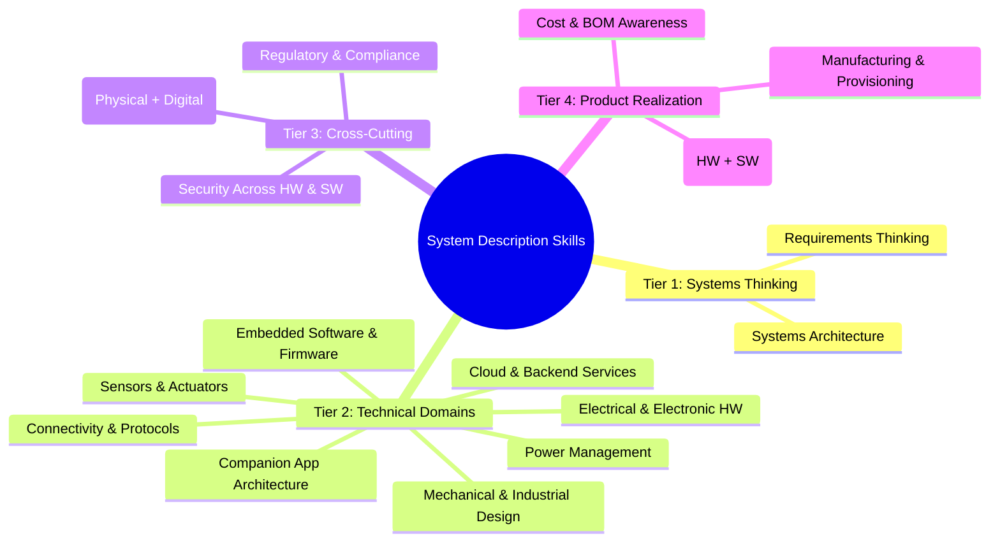

# Skills Map: Writing System Descriptions for Software-Augmented Hardware

This reference identifies the competency areas you need to write architecture-level system descriptions for hardware products whose value depends on software — firmware, companion apps, cloud services, or all three.

The defining challenge of software-augmented hardware: the physical product and the software must be designed together, but they have different iteration speeds, different teams, and different failure modes. The skills below reflect this. Every technical domain includes the HW↔SW boundary perspective — because that boundary is where most architectural mistakes happen.

Use this as a self-assessment. You don't need deep expertise in every area — but you need enough understanding to make informed decisions at the hardware/software boundary and ask the right questions of specialists on both sides.

---

## Tier 1: Systems-Level Thinking

These are the foundational skills. Without them, you produce feature lists, not system descriptions.

### 1. Systems Architecture and Decomposition

Breaking a product into subsystems, defining boundaries, and identifying interfaces — especially the boundary between what runs in hardware and what runs in software.

**What it covers:**
- Block diagram design at multiple abstraction levels — hardware blocks, firmware modules, app components, and cloud services on the same diagram
- Subsystem boundary definition: what belongs in hardware vs. firmware vs. app vs. cloud
- Interface identification between blocks — with special attention to interfaces that cross the HW/SW boundary (sensor→firmware, firmware→app, app→cloud)
- Data flow and control flow mapping end-to-end: physical event → sensor → firmware processing → wireless transmission → app display → user action → command → firmware → actuator
- Deciding what processing runs on-device vs. in the cloud vs. in the app, and why
- Identifying fundamental hardware problems — the physics, geometry, or environment problems that must be solvable for the product to exist. These are not feature requests or nice-to-haves; they're the problems that kill the product if unsolvable (e.g., "can we reject 20°C water to 4°C in a countertop form factor?" or "can an accelerometer distinguish chair tilt from fidgeting?")

**Why it matters for system descriptions:**
This IS the core skill. For software-augmented hardware, the architecture challenge is that hardware and software must be specified together but built by different teams on different timelines. The system description is the shared contract. Every section maps to an architectural element — and every interface between hardware and software needs enough detail for both teams to work independently. Identifying fundamental hardware problems early prevents investing months in detailed design around a physics problem that turns out to be unsolvable.

**Self-assessment:**
- Can you draw a block diagram that shows hardware, firmware, app, and cloud as distinct layers with explicit interfaces between them?
- Can you explain why a particular function belongs in firmware rather than in the companion app (or vice versa)?
- Can you identify which HW↔SW interfaces carry the most technical risk?
- Can you name the 2-3 physical problems that must be solvable for your product to exist — and distinguish them from problems that are merely hard?

### 2. Requirements Thinking

Distinguishing needs from solutions, and tracing from user scenarios through software down to hardware constraints.

**What it covers:**
- Separating the "what" (requirement) from the "how" (implementation) — especially avoiding premature HW/SW partitioning
- Functional vs. non-functional requirements (performance, reliability, security, latency)
- Traceability: linking every architectural choice back to a user need or constraint, across the full stack
- Prioritization: what is essential vs. what is desirable — and which features can ship as software updates after hardware launch
- Identifying which requirements lock hardware decisions (and therefore must be decided early) vs. which can be deferred to software

**Why it matters for system descriptions:**
The system description bridges user needs and technical architecture across both hardware and software. The key discipline: identifying which requirements constrain hardware (and must be decided before PCB layout) vs. which can be delivered or refined through firmware and app updates after manufacturing.

**Self-assessment:**
- Can you rewrite "use BLE 5.0" as a requirement? (e.g., "support wireless communication within 10m at <15mW average power")
- For any architectural decision in your document, can you point to the user scenario that drives it?
- Can you identify which requirements are hardware-locked (can't change after manufacturing) vs. software-flexible (can be updated in the field)?

---

## Tier 2: Technical Domains

These are the building blocks. Each maps to a subsystem or aspect of your block diagram. For software-augmented hardware, pay special attention to where each domain touches the HW↔SW boundary.

### 3. Electrical and Electronic Hardware

MCU/SoC selection, sensor interfacing, power supply design, and PCB-level considerations — with awareness of what the firmware and app will need from the hardware.

**What it covers:**
- MCU/SoC families and selection criteria (ARM Cortex-M, ESP32, nRF, etc.) — including flash/RAM headroom for firmware growth and OTA
- Peripheral interfaces: I2C, SPI, UART, ADC, GPIO — these are the firmware's entry points to the physical world
- Power supply topologies: LDO, buck, boost, battery charging ICs
- PCB strategy: single board, modular, flex-rigid
- Signal integrity basics for mixed-signal designs
- Antenna integration (chip, PCB trace, external)
- Debug and programming interfaces (JTAG/SWD, UART console) — firmware development depends on these
- Test points and factory programming headers — needed for manufacturing provisioning
- Component choice as multi-axis tradeoff — every major component involves tensions between physical constraint (size, weight, thermal), performance (accuracy, speed), availability (lead times, second sources), cost (BOM at target volume), and firmware complexity (how much software effort the part demands). The skill is recognizing which axis dominates for your product and where axes conflict.

**Why it matters for system descriptions:**
Hardware defines the physical capabilities and constraints that all software must operate within. The system description must specify hardware subsystems at block level — what components, what buses, what voltage domains. Every hardware choice either enables or constrains firmware: MCU flash size limits firmware complexity, available peripherals determine which sensors can connect, and debug interfaces determine how firmware is developed and tested. Stating the dominant tradeoff axis per component makes the rationale explicit and reviewable — instead of "we picked part X," you say "we picked part X because cost dominates for this product, and the firmware complexity penalty is acceptable."

**Self-assessment:**
- Can you explain why you'd pick an nRF52 over an ESP32 for a specific product — considering both hardware specs and the firmware/SDK ecosystem?
- Do you know the difference between I2C and SPI and when firmware complexity favors one over the other?
- For a given component, can you name which tradeoff axis dominates and where it conflicts with another axis?
- Can you specify hardware requirements that give firmware enough headroom for planned features plus OTA updates?

### 4. Mechanical and Industrial Design

Enclosure design, thermal management, ingress protection, and physical interaction elements — with awareness of how mechanical choices affect software capabilities.

**What it covers:**
- Enclosure design approaches (injection molding, 3D printed, sheet metal)
- Thermal management: conduction, convection, heat sinks, thermal pads — processing-intensive firmware generates heat
- Ingress protection ratings (IP54, IP67, etc.) and what they require
- Button, LED, display, and connector integration — the physical UI that firmware must drive
- Material selection (plastics, metals, gaskets)
- Antenna placement constraints from the enclosure — directly affects wireless connectivity quality

**Why it matters for system descriptions:**
Mechanical constraints shape what software can do. A sealed IP67 enclosure changes your thermal story (limiting sustained processing), antenna placement (affecting connection reliability), charging approach (constraining app-mediated update flows), and user interaction model (fewer physical controls means more app dependency). The system description must capture these physical realities and their software implications.

**Self-assessment:**
- Do you know what IP67 actually requires in terms of design — and how it affects firmware update mechanisms (no exposed USB)?
- Can you identify when thermal limits constrain firmware processing (e.g., sustained sensor fusion on a thermally limited MCU)?
- Do you understand how enclosure material and antenna placement affect the app's connection reliability?

### 5. Embedded Software and Firmware

RTOS vs. bare-metal, firmware architecture, OTA updates, and on-device processing — the layer that bridges hardware and software.

**What it covers:**
- Operating environment: bare-metal, RTOS (FreeRTOS, Zephyr), embedded Linux
- Architecture patterns: state machines, event-driven, task-based
- Hardware abstraction layers (HAL) and driver models — the firmware's contract with the hardware
- Communication stacks: BLE GATT profiles, Wi-Fi/TCP/MQTT, custom protocols — the firmware's contract with the app and cloud
- OTA update strategy: A/B partitions, differential updates, rollback, image signing — how the product evolves after manufacturing
- On-device data processing and edge computing — what is computed locally vs. sent to cloud
- Boot sequence and initialization
- Firmware versioning and feature capability reporting — how the app knows what this hardware revision can do

**Why it matters for system descriptions:**
Firmware is the integration layer of software-augmented hardware. It translates between physical hardware (registers, interrupts, ADC readings) and software abstractions (BLE characteristics, MQTT topics, structured data). The system description must specify what the firmware owns, what it exposes to the app/cloud, and how it gets updated in the field. Firmware architecture also determines power behavior, connection reliability, and which features can be added post-launch vs. which require new hardware.

**Self-assessment:**
- Can you explain when to use an RTOS vs. bare-metal vs. embedded Linux — and how the choice affects app integration?
- Do you understand how OTA updates work end-to-end (app triggers download → firmware validates → swaps partitions → rolls back on failure)?
- Can you design a firmware architecture where the companion app can query device capabilities and adapt its UI accordingly?

### 6. Connectivity and Protocols

Wireless technologies, protocol selection, and communication architecture — the link between the physical device and its software ecosystem.

**What it covers:**
- Short-range: BLE, WiFi, Zigbee, Thread, Matter
- Long-range: LoRa/LoRaWAN, cellular (LTE-M, NB-IoT, 5G)
- Application protocols: MQTT, HTTP/REST, CoAP, WebSocket
- Protocol selection criteria: range, power consumption, bandwidth, cost, ecosystem — and how each affects the app and cloud architecture
- Network topology: star, mesh, gateway-based
- Provisioning and pairing mechanisms — the first interaction between hardware and app
- Connection lifecycle: discovery, pairing, bonding, reconnection, graceful disconnection
- Data serialization: protobuf, CBOR, JSON, custom binary — what crosses the wireless link

**Why it matters for system descriptions:**
Connectivity is the bridge between the physical product and its software. It determines the app architecture (BLE requires proximity; Wi-Fi enables remote access), the cloud architecture (direct-to-cloud vs. phone-as-gateway), the power budget (radio is usually the largest power consumer), and the user experience (pairing friction, latency, reliability). Every connectivity choice ripples into firmware, app, and cloud design.

**Self-assessment:**
- Can you compare BLE, WiFi, and LTE-M across power, cost, range, bandwidth — and their implications for app architecture?
- Do you know what MQTT provides that HTTP doesn't (and vice versa) for device-to-cloud communication?
- Can you describe the full pairing flow from both the device (firmware) and app perspectives?

### 7. Companion App Architecture

Mobile and desktop applications that pair with the hardware — the user's primary software interface to the physical product.

**What it covers:**
- Platform strategy: iOS, Android, cross-platform (React Native, Flutter), web app
- Device communication: BLE manager, Wi-Fi discovery, local network protocols
- App architecture for hardware-paired products: device state management, connection lifecycle handling, background operation
- Onboarding flows: device discovery → pairing → provisioning → first data display
- Offline behavior: what the app shows when disconnected, cached data strategy, sync on reconnect
- OTA firmware delivery: app as conduit for firmware updates to the device
- Platform constraints: iOS background BLE limits, Android battery optimization, app store review requirements for hardware-paired apps

**Why it matters for system descriptions:**
For most software-augmented hardware products, the companion app IS the primary user interface — the hardware may have only a few LEDs and a button. The system description must define the app's responsibilities, its communication contract with firmware, and how it handles the inherent unreliability of wireless connections. The app also often serves as the gateway for firmware updates and device provisioning.

**Self-assessment:**
- Can you describe what the app does when it loses Bluetooth connection mid-operation?
- Do you know how iOS and Android differ in background BLE behavior — and how that affects your product experience?
- Can you specify the data contract between firmware and app (what messages, what format, what error handling)?

### 8. Cloud and Backend Services

Device management, data pipelines, APIs, and the cloud side of software-augmented hardware.

**What it covers:**
- IoT platforms: AWS IoT Core, Azure IoT Hub, custom, or hybrid
- Device provisioning: certificate management, fleet onboarding — the manufacturing-to-cloud handshake
- Device twins/shadows: state synchronization between device and cloud
- Data pipeline: ingestion, processing, storage, analytics
- API design for companion apps and third-party integrations
- Firmware deployment infrastructure: firmware image hosting, rollout management, fleet segmentation
- Alerting, monitoring, and fleet health dashboards — observability for deployed hardware

**Why it matters for system descriptions:**
The cloud extends the product beyond what the hardware alone can do — analytics, remote monitoring, fleet management, and post-launch feature delivery via firmware updates. The system description must define the device-to-cloud boundary: what data flows up, what commands flow down, how devices authenticate, and what happens during cloud outages (the hardware must still function).

**Self-assessment:**
- Can you explain the device shadow/twin pattern and when it helps for software-augmented hardware?
- Do you know how firmware images get from your build system to deployed devices in the field?
- Can you describe what happens to the hardware product when the cloud is unreachable for hours or days?

### 9. Power Management and Battery Design

Power budgeting, battery selection, charging, and energy-aware architecture — where hardware physics meets firmware strategy.

**What it covers:**
- Power budget analysis: measuring and estimating current per subsystem and operating mode
- Battery chemistry: LiPo, LiFePO4, primary cells (CR2032, AA), and their characteristics
- Charging circuits: linear vs. switching, USB-C PD, wireless charging
- Power states: active, idle, sleep, deep sleep, off — and transition triggers (firmware-controlled)
- Energy harvesting: solar, vibration, thermal
- Power sequencing and domain isolation
- Firmware power management: sleep scheduling, radio duty cycling, sensor polling intervals — the firmware decisions that determine battery life

**Why it matters for system descriptions:**
Power architecture is where hardware capacity meets firmware strategy. The battery is a hardware choice; how that energy is spent is mostly a firmware decision. Radio duty cycles, sensor polling rates, processing schedules, and sleep mode management are all firmware behaviors that directly determine whether the hardware can meet its battery life target. The system description must capture both the hardware power budget and the firmware power strategy as a unified picture.

**Self-assessment:**
- Can you estimate battery life from a power budget and a firmware usage profile (sleep/wake cycles, transmission frequency)?
- Do you know typical current draws for BLE advertising, WiFi transmission, and deep sleep — and which firmware behaviors trigger each?
- Can you design a power state machine that coordinates hardware power domains with firmware sleep scheduling?

### 10. Sensor and Actuator Selection

Choosing sensors and actuators, understanding their specifications, and integrating them — the physical components that firmware turns into product features.

**What it covers:**
- Sensor types: environmental (temp, humidity, pressure), motion (IMU, accelerometer), optical (ambient light, proximity, camera), chemical (gas, particulate), biometric
- Key specs: accuracy, precision, resolution, drift, response time, operating range
- Actuator types: motors (DC, stepper, servo), haptics (LRA, ERM), LEDs, speakers, displays
- Signal conditioning: amplification, filtering, ADC resolution requirements
- Calibration approaches — often requiring firmware support and sometimes cloud-assisted calibration
- Sensor fusion: combining multiple sensor inputs in firmware to produce higher-level data (e.g., IMU + magnetometer → orientation)

**Why it matters for system descriptions:**
Sensors and actuators are the hardware's interface with the physical world — but they only become useful through firmware processing, and their data only reaches users through the app or cloud. The system description must trace the full path: physical measurement → sensor hardware → firmware driver → data processing → wireless transmission → app display. Raw sensor data is rarely what the user sees; the firmware and cloud transformations are part of the product.

**Self-assessment:**
- Can you read a sensor datasheet and extract the specs that matter for your application — including what firmware configuration is needed?
- Can you specify the full data path from sensor reading to user-visible value, including where processing happens at each stage?
- Do you understand where calibration happens (factory, firmware, cloud) and what each approach requires?

---

## Tier 3: Cross-Cutting Concerns

These span all subsystems. They aren't separate blocks on the diagram — they're properties of the whole system that must be consistent across hardware and software.

### 11. Security Across Hardware and Software

Securing the device, its communications, and the data it handles — across every layer from silicon to cloud.

**What it covers:**
- Secure boot chain: hardware root of trust, verified boot stages — hardware provides the anchor, firmware enforces the chain
- Firmware signing and secure OTA delivery — preventing malicious firmware from running on your hardware
- Communication security: TLS/DTLS, certificate pinning — between firmware and cloud, between app and cloud
- Key management: provisioning during manufacturing, rotation via cloud, storage in hardware secure element vs. firmware
- Data protection: encryption at rest (on-device flash), in transit (wireless link), and in cloud storage
- Threat modeling: identifying attack surfaces per interface — physical (JTAG), wireless (BLE sniffing), cloud (API abuse), app (reverse engineering)

**Why it matters for system descriptions:**
Security must be designed across the full stack simultaneously. A secure cloud API is meaningless if firmware accepts unsigned OTA images. Encrypted BLE communication is undermined if the app stores credentials in plaintext. The system description should identify trust boundaries at every HW↔SW interface, specify key storage locations, and define the authentication model between device hardware, firmware, app, and cloud.

**Self-assessment:**
- Can you trace the trust chain from hardware root of trust through firmware boot through cloud authentication?
- Do you know where cryptographic keys are stored on your device and what protects them — hardware secure element, firmware encryption, or nothing?
- Can you identify which attack surfaces span the HW/SW boundary (e.g., JTAG access enabling firmware extraction)?

### 12. Regulatory and Compliance

Certifications, standards, and legal requirements that constrain both hardware design and software behavior.

**What it covers:**
- RF certification: FCC (US), CE/RED (EU), IC (Canada), MIC (Japan), and others
- Safety: UL, IEC 62368-1, IEC 60601 (medical)
- Environmental: RoHS, REACH, WEEE
- Battery: UN38.3 transport testing, IEC 62133
- Wireless: Bluetooth SIG qualification, WiFi Alliance certification
- Country-specific: regional RF requirements, import restrictions
- Software-related: app store requirements for hardware-paired apps, data privacy regulations (GDPR, CCPA), accessibility standards

**Why it matters for system descriptions:**
Regulatory requirements create hard constraints that span hardware and software. RF certification constrains antenna design and firmware radio parameters (transmit power, duty cycle). App store guidelines constrain how the companion app interacts with hardware (background BLE behavior, required permissions disclosures). Data privacy regulations affect what the firmware collects, what the cloud stores, and what the app must allow users to delete. The system description must flag these cross-domain regulatory constraints early.

**Self-assessment:**
- Do you know which certifications your target markets require — for both the hardware and the app?
- Can you identify which firmware parameters affect RF certification (transmit power, channel selection, duty cycle)?
- Do you understand how data privacy regulations affect the full stack — from what the sensor collects to what the cloud retains?

### 13. User Interaction Design (Physical + Digital)

How users interact with the hardware and its software — and how those interactions coordinate across the HW/SW boundary.

**What it covers:**
- Physical UI: buttons, LEDs (color, patterns), displays (type, size), haptic feedback — driven by firmware
- LED language: what each color/pattern means (pairing, error, charging, low battery) — firmware state machine visible to the user
- Companion app: core screens, interaction model, notifications — the primary UI for most software-augmented hardware
- Onboarding and pairing: first-time experience from unboxing to connected — spans physical setup, firmware pairing mode, and app-guided flow
- Coordinated feedback: when the user taps a button on the device, what happens on the app? When the user triggers an action in the app, what does the device do physically?
- Error communication across layers: hardware LED shows red → app displays explanation → cloud logs the event
- Accessibility considerations for both physical and digital interfaces

**Why it matters for system descriptions:**
For software-augmented hardware, the user experience spans two interfaces: the physical product and the companion app. These must be coordinated — a button press on the device should produce consistent feedback on both the device (LED, haptic) and the app (screen update, notification). The system description must define these touchpoints and how firmware and app stay in sync. A LED blinking pattern is a firmware feature, a hardware component choice, and a UX decision — all at once.

**Self-assessment:**
- Can you describe the complete onboarding flow from unboxing to first use — including what the device does physically and what the app shows at each step?
- Do you know how many device states need both physical feedback (LED/sound) and app feedback — and are they consistent?
- Can you explain what happens across all layers when the device encounters an error — what the device shows, what the app shows, what the cloud records?

---

## Tier 4: Product Realization

Connecting the system description to the real world — manufacturing, cost, and validation across both hardware and software.

### 14. Manufacturing and Provisioning

Making the product producible at scale — including the software that must run on the production line.

**What it covers:**
- Assembly process: SMT, through-hole, manual steps, test fixtures
- Design for assembly (DFA): minimizing manual steps, snap-fit vs. screws
- Component selection: availability, lead times, alternate sources
- **Production-line firmware:** the software that runs during manufacturing — flash programming, hardware self-test, sensor calibration, unique identity assignment
- **Device provisioning:** burning unique device IDs, cryptographic keys, certificates — the manufacturing step that connects hardware to cloud
- **Factory test software:** automated test sequences that verify every unit before it ships
- Tooling: injection mold costs, minimum order quantities
- Supply chain: key component sourcing, single-source risks

**Why it matters for system descriptions:**
Manufacturing software-augmented hardware requires software at every stage of production: firmware must be programmed, hardware must be self-tested, sensors must be calibrated, and each device must be provisioned with unique identity and credentials for cloud registration. The system description must account for this production software — it's not the product firmware, but it must be built alongside it.

**Self-assessment:**
- Can you describe what software runs on each device during manufacturing — programming, test, calibration, provisioning?
- Do you know how each device gets its unique identity and cloud credentials during production?
- Can you estimate rough tooling costs for a plastic enclosure and rough time for production firmware development?

### 15. Cost and BOM Awareness

Understanding cost structure and making cost-informed decisions at the hardware/software boundary.

**What it covers:**
- BOM cost estimation at concept stage (component costs, PCB, assembly)
- Cost drivers by subsystem: connectivity modules, batteries, displays, enclosures
- NRE (non-recurring engineering) vs. per-unit cost trade-offs
- Target cost allocation across subsystems
- Volume effects: price breaks, amortized tooling, certification costs
- **HW vs. SW cost tradeoffs:** cheaper hardware with more firmware complexity, or more capable hardware with simpler firmware? On-device processing (hardware cost) vs. cloud processing (ongoing service cost)?
- **Recurring software costs:** cloud infrastructure, cellular data plans, app store fees, third-party API subscriptions

**Why it matters for system descriptions:**
Software-augmented hardware has both per-unit hardware costs and ongoing software costs. The system description should flag where cost pressure exists at the HW/SW boundary. Choosing a more powerful MCU (higher BOM cost) may allow on-device processing that eliminates cloud compute costs. Choosing a cheaper MCU may push processing to the cloud, adding per-device monthly cost. These are architectural decisions with long-term cost implications.

**Self-assessment:**
- Can you estimate the BOM cost of a simple connected device within 30%?
- Can you articulate the cost tradeoff of on-device vs. cloud processing for your product's core feature?
- Do you know the ongoing monthly cost per device for your cloud and connectivity infrastructure?

### 16. Testing and Validation (Hardware + Software)

How you prove the system works — across hardware, firmware, app, and especially their integration.

**What it covers:**
- Hardware verification: functional testing, environmental testing (thermal, vibration, drop)
- Firmware testing: unit tests, integration tests, hardware-in-the-loop (HIL)
- App testing: unit tests, UI tests, simulated device testing
- **HW↔SW integration testing:** end-to-end scenarios with real hardware and real software — pairing, data flow, OTA updates, error recovery
- System-level testing: end-to-end user scenarios, load testing, long-run stability
- Compliance testing: pre-certification scans, EMC testing, safety testing
- Field trials: beta programs, early deployment, monitoring
- **OTA regression:** verifying that firmware updates don't break existing hardware functionality
- **Multi-version compatibility:** testing new app versions against old firmware and vice versa

**Why it matters for system descriptions:**
The hardest bugs in software-augmented hardware live at the HW↔SW boundary — a firmware change that causes BLE disconnects, an app update that breaks pairing with older firmware, a power management change that causes sensor readings to drift. The system description should identify the integration test points where hardware and software meet, because these are where the most damaging failures occur and where testing is most expensive.

**Self-assessment:**
- For each HW↔SW interface, can you describe a test that proves both sides are working correctly together?
- Do you have a strategy for testing new firmware against old app versions (and vice versa)?
- Can you define pass/fail criteria for your product's key end-to-end scenarios — from physical input to app display?

---

## Using This Skills Map

**For writing system descriptions for software-augmented hardware:**
1. Scan the 16 areas. Rate yourself: strong / adequate / need help.
2. For "need help" areas that are relevant to your product, either learn enough to make informed decisions at the HW/SW boundary, or identify a specialist to consult.
3. Pay special attention to skills that span the boundary: Embedded Software (#5), Connectivity (#6), Companion App (#7), and User Interaction (#13). These are where hardware and software teams must agree, and the system description is their shared contract.
4. As you write each section of the system description template, refer back to the relevant skill areas to check you haven't missed important considerations.

**The goal is not mastery of all 16 areas.** It's having enough breadth to write a coherent system description that both hardware and software teams can build from — and enough awareness to know when a decision on one side will break something on the other.
