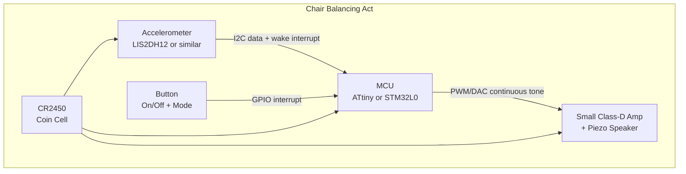
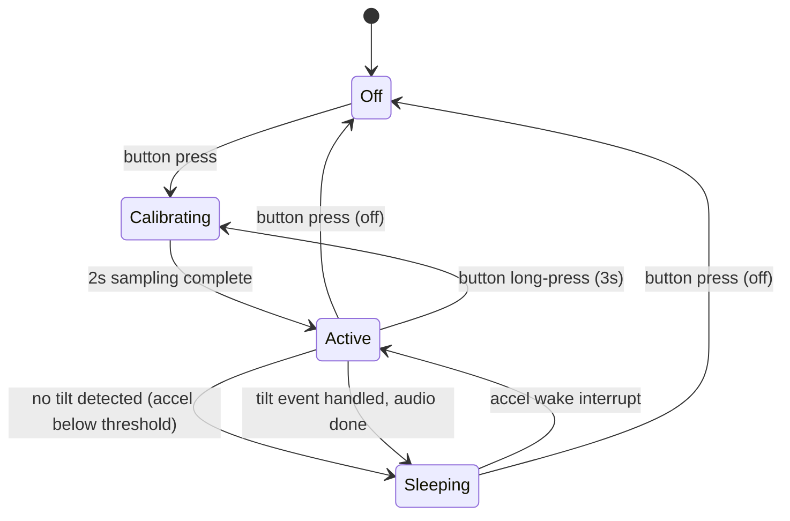

# System Description: Chair Balancing Act

| Field | Value |
|-------|-------|
| Version | 0.1 |
| Date | 2026-02-20 |
| Author | |
| Status | Draft |
| Related docs | hw_sw_high_level_chair_balancing_act.md |

---

## 1. Product Vision and Context

**Product statement:**
For parents, teachers, and pranksters, Chair Balancing Act is a clip-on tilt sensor that produces a continuously escalating audio tone when a chair leaves static balance. All four legs on the floor = silence. The moment any leg lifts, a pleasant low tone begins and rises continuously in pitch, volume, and urgency as tilt increases — reaching maximum alarm just before the chair would fall. Unlike verbal reminders, it provides immediate, proportional, and entertaining feedback that makes the behavior self-correcting.

**Problem:**
Chair tilting — especially by kids in schools and at dining tables — is a universal nuisance and a genuine safety concern. Every parent and teacher has said "stop leaning back on your chair" thousands of times. The behavior persists because there's no immediate consequence until the chair falls. Chair Balancing Act provides that immediate, proportional feedback: the chair itself "speaks up" the moment it enters dynamic balance (any leg off the ground), and the sound intensity tracks the danger level continuously — no discrete thresholds, just a natural escalation that maps directly to physics.

**Deployment context:**
- Environment: Indoor
- Setting: Home (dining room, kitchen), schools (classrooms, cafeterias)
- User type: Consumer — buyers are parents or teachers; end users are kids (and adults who tilt)
- Installation: Self-installed — peel adhesive backing, stick under seat, press button
- Expected lifespan: 1-2 years (novelty product, replaceable coin cell)

---

## 2. User Scenarios

### Scenario 1: The Dinner Table
**Persona:** Tom, 9 years old, habitual chair tilter. Parent bought the device after the third near-fall.
**Situation:** Dinner time. Tom starts leaning back on his chair while chatting.
**Action:** The instant the back legs start to bear the chair's weight alone (front legs lift), a soft, pleasant tone begins — almost musical. Tom keeps leaning. The tone rises smoothly in pitch and volume, becoming more insistent. He leans forward — the tone drops and disappears as all four legs touch down. He tries again. Same response. The family notices and laughs.
**Outcome:** The proportional feedback makes tilting feel like a game — lean more, tone rises; straighten up, silence. After a few days, the habit correction sticks. Parent switches to "stealth" mode (lower max volume) for long-term reinforcement.

### Scenario 2: The Classroom
**Persona:** Ms. Chen, 4th-grade teacher with 5 habitual chair tilters in her class.
**Situation:** She attaches devices to the 5 worst offenders' chairs before school. Serious mode — clean, professional tone escalation.
**Action:** During class, a student leans back. A low hum begins immediately. The student instinctively straightens — silence. Other students hear and self-correct proactively. The continuous nature means there's no "safe tilt zone" to exploit — any departure from static balance produces sound.
**Outcome:** Ms. Chen no longer interrupts lessons to correct posture. The devices provide consistent, proportional, impersonal feedback. She moves them to different chairs as needed.

### Scenario 3: First Use — Unboxing to Attached
**Persona:** A parent who just received the device as a gift.
**Situation:** Opens the packaging, finds the device, an adhesive pad, and a quick-start card.
**Action:** Peels the adhesive backing, sticks the device to the underside of a dining chair. Presses the button — a short chime confirms power-on and calibration (2 seconds). Tilts the chair by hand — hears the tone rise smoothly as tilt increases, and fade to silence on return. Presses the button again to cycle modes (serious → comedic → stealth). Picks one.
**Outcome:** Device is working within 60 seconds of opening the box. No app, no pairing, no setup screen.

### Scenario 4: Battery Replacement
**Persona:** Parent, 3 months after first install.
**Situation:** The device plays a distinctive low-battery chirp (different from the tilt tone) on each tilt event.
**Action:** Parent peels the device off the chair (or reaches under), twists the battery cover, swaps in a new CR2450 from the kitchen drawer, twists shut. Reattaches.
**Outcome:** Device resumes immediately. No recalibration needed — it auto-calibrates on power-up. Total time: 30 seconds.

### Scenario 5: False Trigger — Sitting Down Hard
**Persona:** Tom, dinner time.
**Situation:** Tom pulls out the chair and drops into the seat. The chair rocks momentarily.
**Action:** The accelerometer detects a sharp transient. The firmware's time filter recognizes this as impact, not sustained tilt (duration < 300ms). No sound plays.
**Outcome:** No false alarm. The continuous tone only engages for sustained departures from static balance.

---

## 3. System Architecture

**Architecture narrative:**

The device is a self-contained, single-board system with no wireless connectivity and no cloud dependency. The core signal chain: accelerometer → MCU → amplified speaker. Powered by a CR2450 coin cell.

The accelerometer (LIS2DH12 or equivalent) runs in low-power mode, sampling at 10-25 Hz. It has a configurable threshold interrupt — when tilt exceeds a near-zero programmable angle (the boundary between static and dynamic balance), it fires a wake interrupt to the MCU via GPIO. The MCU sleeps in deep sleep when the chair is in static balance (all legs on the floor).

On wake, the MCU enters a continuous sensing loop: it reads the tilt angle via I2C at 10-25 Hz, applies a time filter (ignore transients < 300ms), and generates a proportional audio tone via PWM or DAC. The tone is continuous and real-time — pitch, volume, and timbre all scale with the current tilt angle. At first departure from static balance, a pleasant low tone begins. As tilt increases, the tone rises smoothly through a designed escalation curve: pitch increases, volume increases, and the timbre shifts from agreeable to urgent. Maximum alarm is reached just before the estimated fall point. When the chair returns to static balance (all legs down), the tone fades to silence and the MCU returns to deep sleep.

The MCU generates the tone directly (no separate audio playback IC needed for continuous tones). A small class-D amplifier drives the piezo speaker. Different modes (serious / comedic / stealth) change the tone character and escalation curve, not discrete clips.

There is no app, no cloud, no wireless, no display. The only user interface is a single button (power on/off + mode cycle) and the audio output.

---

## 4. Subsystem Descriptions

### 4.1 Hardware Subsystem

**MCU / SoC:**
- Part: ATtiny1616 (primary candidate) or STM32L011
- Selection rationale: ATtiny1616 is $0.50-0.70, has 16 KB flash, 2 KB SRAM, I2C, hardware PWM (TCA/TCB timers), and deep sleep at <0.1 µA. The hardware PWM is used to generate continuous tones directly — no separate audio playback IC needed. STM32L0 ($1.00-1.50) is an alternative with DAC output and more headroom if tone synthesis becomes complex.
- Key specs: 20 MHz, 16 KB flash, 2 KB SRAM, I2C master, hardware PWM, 6+ GPIO, deep sleep <0.1 µA

**Sensors:**

| Sensor | Measures | Interface | Sample Rate | Key Spec |
|--------|----------|-----------|-------------|----------|
| LIS2DH12 (or MMA8452Q) | 3-axis acceleration → tilt angle | I2C (400 kHz) | 10-25 Hz (configurable) | Programmable threshold interrupt, 2×2mm LGA, 0.5 µA in low-power mode with interrupt active |

**Actuators:**

| Actuator | Function | Interface | Key Spec |
|----------|----------|-----------|----------|
| Piezo disc (13mm) | Audio output — continuous tilt-proportional tone | Driven by MCU PWM via small class-D amp (e.g., PAM8302 or similar, $0.20-0.40) | 75-85 dB at 10cm, resonant frequency ~2-4 kHz |

**Physical UI elements:**
- Buttons: 1x tactile switch (side-mounted, accessible from under chair). Functions: short press = mode cycle (serious → comedic → stealth → off), long press (3s) = calibration (set current angle as baseline).
- LEDs: None. Audio-only feedback reduces BOM and power draw.
- Display: None.
- Other: Piezo speaker plays a short chime on power-on/off confirmation.

**PCB strategy:**
- Single board, dual-sided, ~30 × 25 mm, 2-layer FR4
- Top side: CR2450 holder (25mm dia, dominates the board), tactile button
- Bottom side: ATtiny1616 (QFN 4×4mm), LIS2DH12 (LGA 2×2mm), class-D amp (SOT-23/MSOP ~3×3mm), passives (decoupling caps, pull-ups, RC filter for PWM smoothing)
- Piezo disc: mounted inside enclosure wall, soldered to PCB pads at edge
- Test pads: UPDI programming (ATtiny), I2C test points, power rails — accessible on bottom side for factory programming

**Enclosure:**
- Shape: 32 mm round (or 35 × 28mm oval), 10mm tall
- Material: ABS injection-molded, matte black
- Speaker slots: 5 edge slots on one side for piezo sound output
- Battery access: twist-lock top cover for CR2450 replacement
- Mounting: 3M Command-strip style adhesive pad on bottom face
- Weight: ~15g total (PCB+components 5g, coin cell 6g, speaker 1.5g, enclosure 2.5g)

### 4.2 Firmware Subsystem

**Architecture:**
- OS/framework: Bare-metal (no RTOS). The task is simple enough for a main loop + interrupt-driven sleep/wake.
- Rationale: ATtiny1616 has 16 KB flash and 2 KB SRAM. An RTOS adds overhead without benefit for a single-task system. Bare-metal gives full control over sleep behavior and minimizes power consumption.

**Major modules:**

| Module | Responsibility | Inputs | Outputs |
|--------|---------------|--------|---------|
| Sleep manager | Enter deep sleep when chair is in static balance (all legs down). Wake on accelerometer interrupt or button press. | Interrupt lines | MCU power state |
| Tilt reader | Read accelerometer via I2C at 10-25 Hz, compute pitch and roll angles from raw XYZ | I2C data from LIS2DH12 | Tilt angle (degrees) |
| Tilt filter | Distinguish sustained tilt (dynamic balance) from transient motion. Require tilt > dead-band for > 300ms before engaging tone. Low-pass filter on angle for smooth tone output. | Tilt angle stream | Filtered tilt angle (continuous, 0° to max) |
| Tone generator | Map filtered tilt angle to continuous audio output via PWM. Pitch, volume, and timbre scale proportionally with angle. Escalation curve: pleasant low tone at first departure from static balance → rising pitch and volume → maximum alarm near fall point. | Filtered tilt angle, current mode | PWM output to class-D amp |
| Escalation curves | Define the tilt-to-tone mapping for each mode. Serious: clean rising sine/square tone. Comedic: warbling, pitch bends, character. Stealth: quiet, narrow volume range. | Current mode | Curve parameters for tone generator |
| Mode manager | Track current mode (serious / comedic / stealth / off). Cycle on button short-press. Persist in EEPROM. | Button press events | Current mode |
| Calibration | On power-up: sample accelerometer for 2 seconds, average = baseline "level" (static balance). On long-press (3s): resample and set new baseline. Store in EEPROM. | Accelerometer readings, button hold | Baseline angle offset (defines 0° = static balance) |
| Battery monitor | Check VCC via internal ADC periodically. If below threshold (~2.4V), play low-battery chirp on next wake. | Internal ADC | Low-battery flag |

**OTA update strategy:**
- None. No wireless connectivity. Firmware is programmed at factory via UPDI (ATtiny) or SWD (STM32). No field updates.
- If a firmware bug is found post-manufacturing, the device cannot be updated. Acceptable risk for a $15-25 novelty product — but the escalation curve tuning must be thoroughly tested before production since it cannot be adjusted in the field.

**On-device processing:**
- Tilt angle calculation from raw XYZ accelerometer data (atan2)
- Low-pass filtering to reject transients (exponential moving average with ~300ms time constant)
- Baseline subtraction (calibration offset — defines static balance as 0°)
- Dead-band check (below ~2° from baseline = static balance = silent)
- Continuous tilt-to-tone mapping: angle → pitch (Hz) + volume (PWM duty cycle) + timbre (waveform shape)
- Real-time PWM output generation at audio rates

All processing is local. There is no cloud, no app, no data leaving the device.

**Boot-to-ready:** < 3 seconds (power-on → 2s calibration sampling → chime → active)

### 4.3 Mobile / Companion App Subsystem

**Not applicable.** No app. No wireless connectivity. The device is fully standalone.

This is intentional: the product's appeal depends on zero-setup simplicity. Stick it on, press the button, done. An app would add cost (BLE module), complexity, and friction for a novelty product.

### 4.4 Cloud / Backend Subsystem

**Not applicable.** No cloud. No data collection. No accounts. No subscriptions.

---

## 5. Interfaces

### Internal Interfaces (within device)

| Interface | From | To | Protocol | Data | Rate | Notes |
|-----------|------|----|----------|------|------|-------|
| Tilt data | LIS2DH12 | MCU | I2C (400 kHz) | 3-axis acceleration (6 bytes) | On wake (10-25 Hz when active, 0 when sleeping) | MCU is I2C master |
| Wake interrupt | LIS2DH12 INT1 | MCU GPIO | Active-high GPIO | Threshold exceeded | Event-driven | Wakes MCU from deep sleep |
| Tone output | MCU PWM pin | Class-D amp input | PWM (variable frequency + duty cycle) | Continuous audio waveform | Real-time during dynamic balance | Frequency and amplitude scale with tilt angle |
| Button | Tactile switch | MCU GPIO | Active-low with internal pull-up | Press/release | Event-driven (interrupt) | Debounced in firmware (20ms) |
| Power | CR2450 | All components | Direct 3V rail | — | — | No regulator needed — all components operate at 2.0-3.6V |

### External Interfaces

| Interface | From | To | Protocol | Data | Rate | Notes |
|-----------|------|----|----------|------|------|-------|
| Audio output | Class-D amp | Piezo speaker | Direct drive | Amplified continuous tone | During dynamic balance only | Tone generated by MCU in real-time |

### Physical Connectors

| Connector | Purpose | Type | Notes |
|-----------|---------|------|-------|
| Battery compartment | Power | CR2450 twist-lock cover | User-accessible for battery replacement |
| UPDI header | Factory programming | 3-pad test points (VCC, UPDI, GND) | Pogo-pin contact during factory test, not user-accessible |
| Adhesive pad | Mounting | 3M Command-strip dual adhesive | Bottom face of enclosure, removable and repositionable |

---

## 6. Power Architecture

**Power source:**
- Type: CR2450 coin cell (primary lithium)
- Capacity: 600 mAh at 3.0V
- Charging: Not rechargeable. User replaces cell.

**Power states:**

| State | MCU | Accelerometer | Audio IC | Typical Duration |
|-------|-----|--------------|----------|----------------:|
| Off | Off | Off | Off | Until button press |
| Calibrating | Active, sampling I2C | Active, 25 Hz | Off | 2 seconds |
| Active | Running, generating tone via PWM | Active, 25 Hz | Amp on, driving speaker (continuous) | Duration of dynamic balance |
| Sleeping | Deep sleep (<0.1 µA) | Low-power with interrupt (0.5 µA) | Amp shutdown (<0.1 µA) | Seconds to hours (static balance) |

**Power budget (sleeping — dominant state):**

| Component | Current | Notes |
|-----------|--------:|-------|
| MCU (deep sleep) | 0.1 µA | ATtiny1616 power-down mode |
| Accelerometer (low-power + interrupt) | 0.5 µA | LIS2DH12 low-power mode at 10 Hz with threshold interrupt |
| Class-D amp (shutdown) | 0.1 µA | Amp in shutdown mode |
| Leakage + passives | 0.3 µA | Conservative estimate |
| **Total sleeping** | **1.0 µA** | |

**Power budget (active — tilt event, ~1 second):**

| Component | Current | Duration | Charge |
|-----------|--------:|----------|-------:|
| MCU (running, I2C read + PWM generation) | 4 mA | 3 s avg | 12 µAh |
| Class-D amp + piezo (tone output) | 10 mA avg (varies with volume) | 3 s avg | 30 µAh |
| Accelerometer (active) | 10 µA | 3 s | 0.03 µAh |
| **Total per tilt event (avg 3s)** | | | **~42 µAh** |

**Battery life estimate:**

Usage profile: 8 hours/day, ~20 tilt events per day averaging 3 seconds each (a fidgety kid).

| Component | Daily charge |
|-----------|------------:|
| Sleeping (16 hrs off + ~7.98 hrs sleeping) | 23.98 hrs × 1.0 µA = 24 µAh |
| Active events (20 × 42 µAh) | 840 µAh |
| **Total daily** | **~864 µAh** |

Battery life: 600,000 µAh / 864 µAh/day = **~694 days = ~23 months**

Note: continuous tone draws more per event than discrete clips (3s of active audio vs. 0.5s), but the total is still well within CR2450 capacity. At 50 events/day averaging 5s each: 600,000 / (24 + 2100) = ~282 days = ~9 months.

**Battery life target (>2 months) is easily met.** Typical use gives ~23 months; heavy use (~50 events/day, 5s each) gives ~9 months.

---

## 7. Connectivity Architecture

**Not applicable.** No wireless connectivity. Fully standalone device.

---

## 8. Key Technical Decisions and Trade-offs

### Decision 1: No Wireless / No App
- **Options considered:** (A) Standalone, audio-only, no connectivity. (B) BLE to companion app for sound customization and sensitivity settings. (C) Wi-Fi for cloud analytics.
- **Chosen:** A — Standalone
- **Rationale:** The product is a $15-25 novelty/gift. Adding BLE adds ~$2-3 BOM (nRF52 vs. ATtiny), requires an app (development + maintenance for iOS and Android), adds pairing friction to first use, and doubles firmware complexity. The core value — immediate audio feedback on tilt — requires zero connectivity. Sound customization and sensitivity adjustment are nice-to-haves, not must-haves for V1.
- **Consequences:** Sounds are fixed at factory. Sensitivity is set by auto-calibration + fixed thresholds. No data collection, no usage analytics. If V2 needs an app, the MCU must change (ATtiny → nRF52), requiring a board respin.
- **Risks:** Users may want to customize sounds. Mitigation: ship with 3 built-in modes (serious / comedic / stealth) to cover the main use cases. Evaluate app demand from customer feedback before committing to V2.

### Decision 2: ATtiny1616 vs. STM32L0 vs. nRF52
- **Options considered:** (A) ATtiny1616 ($0.50-0.70, 16 KB flash, no BLE). (B) STM32L011 ($1.00-1.50, 16 KB flash, more peripherals, no BLE). (C) nRF52810 ($2.50-3.00, 192 KB flash, BLE 5.0).
- **Chosen:** A — ATtiny1616
- **Rationale:** Cost dominates. At <$8 BOM target, saving $0.50-2.00 on the MCU matters. The firmware needs: I2C master, 3-4 GPIO, deep sleep <1 µA, and ~4 KB of code. ATtiny1616 handles all of this. STM32L0 is acceptable but costs more for unused capability. nRF52 is 5x the price for BLE we don't use in V1.
- **Consequences:** No BLE path without a board respin. Limited flash (16 KB) constrains firmware growth — but the application is simple and unlikely to grow significantly.
- **Risks:** If the firmware exceeds 16 KB (unlikely), the ATtiny1616 has a 32 KB sibling (ATtiny3216, same pinout, ~$0.80). Pin-compatible upgrade path exists.

### Decision 3: MCU-Generated Continuous Tone vs. Discrete Clip Playback IC
- **Options considered:** (A) Dedicated audio playback IC with stored clips triggered per-zone. (B) MCU generates continuous tone directly via PWM, with a small class-D amp.
- **Chosen:** B — MCU-generated continuous tone
- **Rationale:** The alerting model is continuous escalation, not discrete zones. The tone must track tilt angle in real-time — rising smoothly as tilt increases and fading as the chair returns to level. A clip-based audio IC cannot do this; it plays fixed-length clips. MCU PWM generation gives full real-time control over pitch, volume, and waveform shape. The ATtiny1616's hardware PWM timers (TCA/TCB) can generate tones from ~200 Hz to ~10 kHz with minimal CPU overhead. A small class-D amp ($0.20-0.40, e.g., PAM8302) provides the gain stage.
- **Consequences:** Removes a programmable component from the BOM (no audio IC to flash at factory). Tone design moves entirely into firmware — the escalation curves, waveform shapes, and mode characters are all code, not audio files. This makes iteration faster (reflash MCU only) but means the sound is synthesized, not recorded.
- **Risks:** Synthesized tones may feel less rich than recorded clips, especially for the "comedic" mode. Mitigation: use frequency modulation, pitch sweeps, and waveform mixing to add character. If richer audio is needed in V2, an audio IC can be added alongside the amp.

### Decision 4: Piezo Speaker vs. Dynamic Speaker
- **Options considered:** (A) 13mm piezo disc (2.5mm tall). (B) 15-20mm dynamic micro speaker (4-5mm tall).
- **Chosen:** A — Piezo disc
- **Rationale:** The 10mm enclosure height is the hard constraint. The coin cell is 5.4mm, PCB + components underneath is ~1.5mm, leaving ~3mm for walls + clearance. A piezo disc at 2.5mm fits inside the enclosure wall. A dynamic speaker at 4-5mm would force the enclosure to 12-13mm tall — 20-30% larger. For continuous synthesized tones, the piezo's resonant characteristics actually help — the tone naturally becomes louder and more piercing near the piezo's resonant frequency (~2-4 kHz), which can be used as part of the escalation curve.
- **Consequences:** Limited low-frequency response. The tone escalation curve must be designed within the piezo's effective range (~500 Hz to 5 kHz). Low-tilt tones at lower frequencies will be quieter; high-tilt tones at higher frequencies will be naturally louder — this aligns with the desired escalation behavior.
- **Risks:** Piezo may not be loud enough in noisy environments (school cafeteria). The 75-85 dB at 10cm spec is adequate for a classroom or dining room. For louder environments, V2 could use a dynamic speaker with a taller enclosure.

---

## 9. Constraints

### Regulatory
- Required certifications: CE (EU), FCC Part 15 (US — not required if no intentional radiator, but may need unintentional radiator testing depending on clock frequencies)
- Since there is no wireless radio, no Bluetooth SIG or WiFi Alliance certification needed
- Target markets: US, EU, UK, Australia
- RoHS compliant components required

### Environmental
- Operating temperature: 0°C to 50°C (indoor only)
- Storage temperature: -20°C to 60°C
- Ingress protection: Not rated (indoor use, no water exposure expected)
- Drop: Must survive 1.5m drop onto hard floor (falls off chair)
- Vibration: Normal handling only

### Cost

| Item | Target | Notes |
|------|-------:|-------|
| BOM (at 1k units) | <$8.00 | |
| BOM (at 10k units) | <$5.50 | Volume pricing on MCU, accel, audio IC |
| Retail price | $15-25 | Gift/novelty price point |
| Target gross margin | 55-65% | At retail, after COGS |

**BOM estimate (1k units):**

| Component | Est. Cost |
|-----------|----------:|
| ATtiny1616 (QFN) | $0.60 |
| LIS2DH12 accelerometer | $0.80 |
| Class-D amp (PAM8302 or equiv) | $0.30 |
| Piezo disc (13mm) | $0.30 |
| CR2450 holder | $0.25 |
| CR2450 battery (included) | $0.40 |
| Tactile button | $0.10 |
| PCB (30×25mm, 2-layer, dual-sided) | $0.50 |
| Passives (caps, resistors, ~10 pcs) | $0.15 |
| Enclosure (injection-molded ABS) | $1.50 |
| Adhesive pad (3M style) | $0.20 |
| Packaging (box + quick-start card) | $0.80 |
| Assembly + test | $1.50 |
| **Total COGS** | **~$7.40** |

At 10k units: enclosure tooling amortized, component volume pricing → ~$5.20.

### Manufacturing
- Target annual volume: 5,000-20,000 units (years 1-2)
- Assembly: SMT for PCB (single-sided reflow for bottom components, manual or selective solder for coin cell holder on top), manual enclosure snap-fit assembly
- Test requirements: Functional test (tilt → continuous tone plays and scales with angle), battery voltage check, programming via pogo-pin UPDI jig
- No separate audio IC programming step — all audio logic is in MCU firmware

### Schedule
- Key milestones: Prototype on breadboard (M1), PCB v1 (M2), Enclosure prototype (M3), Sound design complete (M3), Production units (M5)
- Hard deadlines: None identified (no seasonal window, no partner commitments)
- Certification: CE/FCC for unintentional radiator — ~4-8 weeks, ~$2-5K

### Dependencies
- Tone design: Need sound designer to define escalation curves for 3 modes — pitch ranges, waveform shapes, modulation patterns
- Enclosure tooling: Injection mold, ~$3-5K for small run tooling, 4-6 weeks lead time
- No SDK dependencies, no cloud dependencies, no third-party APIs

---

## 10. Open Questions and Risks

| # | Question / Risk | Category | Impact | Owner | Target Date | Status |
|---|----------------|----------|--------|-------|-------------|--------|
| 1 | Escalation curve tuning: what tilt-to-pitch/volume mapping feels natural across different chair types? The curve must start agreeably at first departure from static balance and reach max urgency near the fall point — not too early, not too late. Needs testing on 5+ chair types. | Technical | H | FW Lead | M2 | Open |
| 2 | Tone design for 3 modes: what waveform shapes, modulation patterns, and pitch ranges define serious vs. comedic vs. stealth? Comedic mode must be genuinely entertaining, not just annoying. Needs a sound designer collaborating with FW. | Product | H | Product Lead | M3 | Open |
| 3 | Piezo volume: is 75-85 dB at 10cm sufficient in a school classroom (~60 dB ambient)? The continuous tone must be audible at low tilt (start of escalation) without being ear-splitting at max. | Technical | M | HW Lead | M2 | Open |
| 4 | Accelerometer false triggers: how well does the 300ms time filter reject sitting down, standing up, and bumping the table? The continuous model means any sustained departure from static balance produces sound — the dead-band threshold (~2°) is critical. | Technical | M | FW Lead | M2 | Open |
| 5 | Enclosure adhesive durability: does the 3M-style pad hold for months under a chair seat that experiences daily vibration and temperature changes? Needs accelerated adhesion testing. | Technical | M | Mech Lead | M3 | Open |
| 6 | PWM audio quality: can the ATtiny1616 PWM + RC filter produce tones that are pleasant at low tilt? May need higher-order filtering or STM32 DAC if PWM artifacts are audible. | Technical | M | FW Lead | M2 | Open |
| 7 | Regulatory: does the piezo speaker at ~80 dB require any acoustic safety consideration for children's products (CPSIA, EN 71)? | Regulatory | M | Quality Lead | M2 | Open |

---

## Appendix

### Glossary

| Term | Definition |
|------|-----------|
| Static balance | All chair legs on the floor. The device is silent in this state. Defined by the calibration baseline ± dead-band (~2°). |
| Dynamic balance | One or more chair legs off the floor — the chair is tilting. Any sustained departure from static balance triggers the continuous tone. |
| Escalation curve | The mapping from tilt angle to audio output (pitch, volume, timbre). Starts with a pleasant low tone at first departure from static balance and rises continuously to maximum alarm near the fall point. Each mode has its own curve. |
| Mode | One of three tone characters: serious (clean rising tone), comedic (warbling, pitch bends, character), stealth (low max volume, subtle). |
| Dead-band | A small angle range (~2°) around the calibration baseline where the device remains silent, preventing triggers from floor unevenness or micro-movements. |
| Baseline calibration | The process of sampling the accelerometer for 2 seconds to determine "level" (static balance = 0°) for the current chair. Happens automatically on power-up and manually on button long-press. |
| Transient filter | Firmware logic that requires tilt to persist for >300ms before engaging the continuous tone, preventing false triggers from sitting down or bumping the chair. |

### Reference Documents

| Document | Location | Relevance |
|----------|----------|-----------|
| LIS2DH12 datasheet | ST Microelectronics | Accelerometer specs, interrupt configuration, I2C protocol |
| ATtiny1616 datasheet | Microchip | MCU specs, UPDI programming, deep sleep modes, TCA/TCB PWM timers |
| PAM8302 datasheet | Diodes Inc | Class-D mono amp, shutdown mode, gain, SOT-23 package |

### Revision History

| Version | Date | Author | Changes |
|---------|------|--------|---------|
| 0.1 | 2026-02-20 | | Initial draft |
