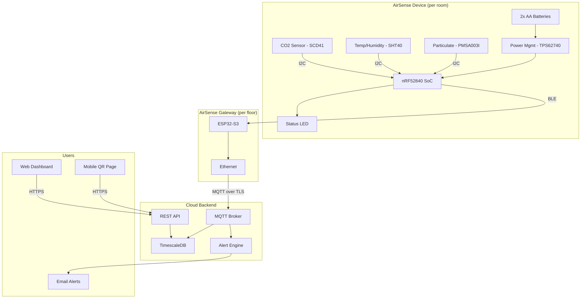
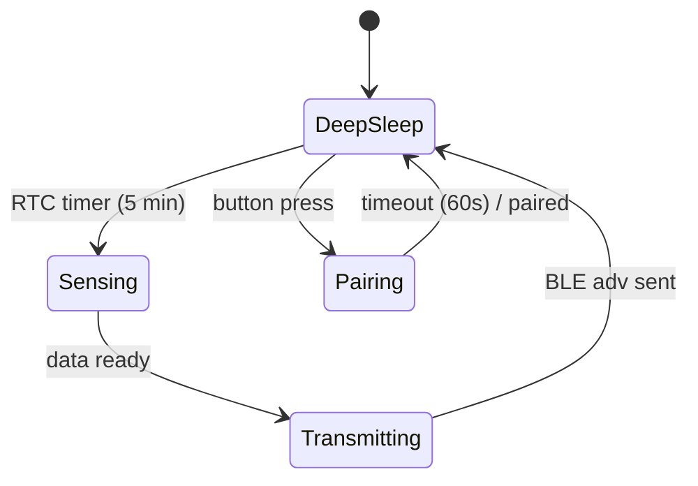

# System Description: AirSense Indoor Environment Monitor

| Field | Value |
|-------|-------|
| Version | 0.1 |
| Date | 2026-02-19 |
| Author | [Example] |
| Status | Draft |
| Related docs | hw_sw_high_level_smart_sensor_hub.md |

*This is a worked example showing expected depth and format. Core sections are filled in. Some sections remain stubs to keep the example focused.*

---

## 1. Product Vision and Context

**Product statement:**
For office facility managers, AirSense is a wireless indoor environment monitor that tracks air quality, temperature, and humidity across multiple rooms and surfaces insights through a web dashboard. Unlike standalone CO2 meters, it provides building-wide coverage with centralized monitoring and historical trends.

**Problem:**
Indoor air quality directly affects occupant health, comfort, and productivity, but most office buildings have no room-level monitoring. Facility managers rely on complaints rather than data. Standalone consumer sensors provide single-room readings with no aggregation or alerting.

**Deployment context:**
- Environment: Indoor only
- Setting: Commercial offices, 10-200 rooms per building
- User type: Professional (facility managers), with read-only access for occupants
- Installation: Self-installed — magnetic mount, no wiring
- Expected lifespan: 5 years (battery-replaceable)

---

## 2. User Scenarios

### Scenario 1: Morning Air Quality Check
**Persona:** Maria, facility manager at a 50-person office
**Situation:** Arrives at 7:30 AM, before employees. Wants to verify overnight ventilation was adequate.
**Action:** Opens the AirSense web dashboard on her laptop. Sees a floor map with color-coded rooms (green/yellow/red based on CO2 levels).
**Outcome:** Two meeting rooms show elevated CO2 from the previous evening. She adjusts HVAC scheduling for those zones before the day starts.

### Scenario 2: Occupant Checks Room Conditions
**Persona:** David, software engineer in an open-plan area
**Situation:** Feels the office is stuffy after lunch. Scans the QR code on the nearest AirSense device.
**Action:** Sees current temperature (24.2°C), humidity (55%), and CO2 (980 ppm) on a simple mobile-friendly page.
**Outcome:** Confirms the room is above comfort thresholds. Submits a one-tap "too warm" report that logs to the facility manager's dashboard.

### Scenario 3: Low Battery Alert
**Persona:** Maria, facility manager
**Situation:** Device in Conference Room B has reached 10% battery after 11 months.
**Action:** Dashboard shows a yellow battery icon for that device. Maria receives an email notification with device location and battery level.
**Outcome:** Maria replaces the two AA batteries during a routine walk-through. Device resumes reporting within 30 seconds of battery insertion.

---

## 3. System Architecture

**Architecture narrative:**

AirSense uses a two-tier wireless architecture. Individual sensor devices communicate over BLE to a per-floor gateway, which aggregates data and forwards it to the cloud over Ethernet. This avoids putting WiFi radios in battery-powered sensor nodes — a key decision for achieving the 12-month battery life target.

Each device samples three environmental sensors (CO2, temperature/humidity, particulate matter) on a configurable interval (default: 5 minutes). The nRF52840 SoC handles sensor reading, local averaging, and BLE advertisement. The device spends >99% of its time in deep sleep.

The gateway runs on an ESP32-S3 with Ethernet, placed centrally on each floor. It scans for BLE advertisements from sensor devices, parses the payload, and publishes to the cloud MQTT broker over TLS. The gateway is mains-powered and always on.

The cloud backend stores time-series data in TimescaleDB, serves the web dashboard and mobile QR pages through a REST API, and runs an alert engine for threshold violations and device health (low battery, missing reports).

### Fundamental Hardware Problems

| Problem | Why It's Fundamental |
|---------|---------------------|
| Powering a PM sensor from AA batteries for 12 months | The PMSA003I draws 25 mA during sampling — 50x more than all other components combined. This single component defines whether the product can meet its battery life target or must compromise on features (drop PM) or form factor (larger batteries). |
| Getting accurate CO2 readings with a 5-second sensing window | The SCD41 specifies 15 seconds warm-up for full accuracy. A 5-second window to save power may degrade accuracy below ±50 ppm. If 15s is required, the CO2 sensing power budget triples. |
| BLE advertisement reliability at 50 nodes per gateway | 50 devices advertising on 3 BLE channels every 5 minutes creates collision probability. Missed advertisements mean gaps in the dashboard, which undermines facility manager trust — the product's core value. |

### Component Choice Architecture

| Component | Dominant Axis | Key Tension | Resolution Direction |
|-----------|--------------|-------------|---------------------|
| MCU (nRF52840) | Performance | Best BLE power efficiency ($4-5) vs. ESP32-C3 ($1-2, worse sleep current) | nRF52840 — 12-month battery target is non-negotiable |
| CO2 sensor (SCD41) | Performance | $8-12 at volume, dominates BOM — no cheaper alternative meets accuracy spec | Accept the cost — CO2 accuracy is the product's credibility |
| PM sensor (PMSA003I) | Cost vs. power | Adds ~$8 and dominates power budget. Dropping it saves cost and battery but removes a differentiator | Make PM a removable module — offer two SKUs |
| Power regulator (TPS62740) | Power efficiency | 360 nA quiescent ($1.50) vs. LDO ($0.30, 10-50 µA quiescent that costs months of battery) | TPS62740 — quiescent current directly maps to battery life |
| Gateway MCU (ESP32-S3) | Cost | Cheapest path to BLE scanner + Ethernet ($3-4). Mains-powered, so power efficiency irrelevant. | ESP32-S3 — no real tension |

---

## 4. Subsystem Descriptions

### 4.1 Hardware Subsystem

**MCU / SoC:**
- Part: Nordic nRF52840
- Rationale: Best-in-class BLE power consumption, mature SDK (nRF Connect SDK / Zephyr), 256KB RAM sufficient for sensor processing, built-in ARM CryptoCell for secure operations
- Key specs: 64 MHz Cortex-M4F, 256KB RAM, 1MB Flash, BLE 5.3

**Sensors:**

| Sensor | Measures | Interface | Sample Rate | Key Spec |
|--------|----------|-----------|-------------|----------|
| Sensirion SCD41 | CO2, temp, humidity | I2C | 1 / 5 min | ±40 ppm + 5% CO2 accuracy |
| Sensirion SHT40 | Temperature, humidity | I2C | 1 / 5 min | ±0.2°C, ±1.8% RH |
| Plantower PMSA003I | PM1.0, PM2.5, PM10 | I2C | 1 / 5 min | ±10 µg/m³ |

**Physical UI:**
- LEDs: 1x RGB LED (status: green = good, yellow = moderate, red = poor, blue = pairing)
- Buttons: 1x tact switch (recessed, for reset/pairing)
- QR code: Printed on label, links to device-specific mobile page

**PCB strategy:**
Single board, approximately 45mm x 45mm. SCD41 requires airflow exposure — PCB mounted near ventilation slots in enclosure. Antenna keep-out zone on one edge for BLE PCB trace antenna.

### 4.2 Firmware Subsystem

**Architecture:**
- OS/framework: Zephyr RTOS (via nRF Connect SDK)
- Rationale: Zephyr provides a proven BLE stack (SoftDevice controller), I2C drivers, power management primitives, and MCUboot for secure OTA — all maintained by Nordic. Bare-metal would save RAM but require implementing the BLE stack from scratch.

**Major modules:**

| Module | Responsibility | Inputs | Outputs |
|--------|---------------|--------|---------|
| Sensor manager | Read SCD41, SHT40, PMSA003I on schedule. Handle warm-up timing, error recovery, and sensor power gating. | RTC timer, I2C data | Sensor readings (CO2 ppm, T, RH, PM2.5) |
| BLE advertiser | Encode sensor readings into BLE extended advertisement payload (~20 bytes). Transmit on configurable interval. | Sensor readings | BLE advertisement |
| Power manager | Control deep sleep entry/exit, sensor power gating (especially PM sensor), battery voltage monitoring via ADC | RTC wakeup, ADC readings | Power state transitions, low-battery flag |
| OTA manager | Receive firmware images via BLE DFU (MCUboot), validate image signature, apply update on next boot with rollback on failure | BLE DFU data from gateway | Firmware update, rollback |
| Config manager | Store and apply device configuration (sample interval, PM enable/disable, BLE TX power). Configurable via BLE write characteristic from gateway. | BLE write from gateway | Applied configuration |

**OTA update strategy:**
- Delivery: Cloud → gateway (MQTT) → sensor node (BLE DFU via MCUboot)
- Image signing: Ed25519 signature verified before boot
- Rollback: MCUboot A/B partitioning — if new image fails boot test, reverts to previous
- Coordination: Gateway schedules DFU during a node's next BLE connection window (after data upload)

**Firmware versioning:** Semantic versioning (MAJOR.MINOR.PATCH) embedded in BLE advertisement payload. Gateway reports version to cloud for fleet tracking.

### 4.3 Mobile / Companion App Subsystem
*[No native app. QR code links to mobile-optimized web page served by the cloud API. Gateway configuration via local web UI.]*

### 4.4 Cloud / Backend Subsystem

**Platform:** AWS (IoT Core for MQTT, ECS for API, RDS/TimescaleDB for storage)

**Device provisioning:** Each sensor node has a unique device ID burned into nRF52840 FICR at manufacturing. Gateway registers new devices on first advertisement. Cloud assigns identity and issues MQTT topic.

**Data model:**
- Telemetry: device_id, timestamp, CO2_ppm, temp_C, rh_pct, pm25_ugm3, battery_pct — stored in TimescaleDB with 90-day retention at full resolution, 2-year retention at 1-hour aggregates
- Device health: last_seen, fw_version, battery_level, gateway_id
- Alerts: threshold violations (CO2 > 1000 ppm, temp > 27°C), device offline > 30 min, low battery < 10%

**Device management:** Remote config push (sample interval, PM enable/disable), firmware deployment to fleet segments, device health dashboard

---

## 5. Interfaces

### Internal Interfaces (sensor node)

| Interface | From | To | Protocol | Data | Rate | Notes |
|-----------|------|----|----------|------|------|-------|
| CO2 data | SCD41 | nRF52840 | I2C (100 kHz) | CO2 ppm, temp, RH (6 bytes) | Every 5 min | 15s warm-up required (TBD: may reduce to 5s) |
| T/H data | SHT40 | nRF52840 | I2C (400 kHz) | Temp, RH (4 bytes) | Every 5 min | 10ms measurement, negligible power |
| PM data | PMSA003I | nRF52840 | I2C (100 kHz) | PM1.0, PM2.5, PM10 (12 bytes) | Every 30 min (TBD) | Sensor powered down between readings via MOSFET gate |
| Status LED | nRF52840 | RGB LED | 3x GPIO (PWM) | Color + blink pattern | On data Tx, on alert | <1 mA average, 50ms flash |
| Button | Tact switch | nRF52840 | GPIO (active-low, debounced) | Press event | On demand | Recessed, for reset/pairing |

### External Interfaces

| Interface | From | To | Protocol | Data | Rate | Notes |
|-----------|------|----|----------|------|------|-------|
| BLE advertisement | Sensor node | Gateway | BLE 5.3 extended advertising | 20-byte payload (device ID, sensor readings, battery, FW version) | Every 5 min | One-way; gateway passively scans |
| BLE DFU | Gateway | Sensor node | BLE connection (MCUboot DFU) | Firmware image chunks | On OTA trigger | Two-way; gateway initiates connection |
| Gateway uplink | Gateway | Cloud | MQTT over TLS 1.2, Ethernet | JSON telemetry messages per device | On each received advertisement | ~200 bytes per message |
| Dashboard API | Cloud | Web browser | HTTPS REST | Room data, alerts, device health | On page load + 30s polling | Standard REST, JWT auth |
| QR page | Cloud | Mobile browser | HTTPS | Single-room current readings | On QR scan | No auth, device-specific URL |

---

## 6. Power Architecture

**Power source:**
- Type: 2x AA lithium primary cells (Energizer Ultimate Lithium L91)
- Capacity: ~3000 mAh each, 3.0V nominal (2 cells in series = 6V input, regulated down)
- Charging: N/A — battery replacement
- Rationale: AA cells are universally available, replaceable by facility staff without tools, and avoid LiPo complexity (no charging circuit, no battery management, no UN38.3 concerns)

**Power states:**

| State | MCU | Radio | Sensors | LED | Duration |
|-------|-----|-------|---------|-----|---------|
| Deep Sleep | OFF (RTC only) | OFF | OFF | OFF | ~299 s |
| Sensing | Active | OFF | Sampling | OFF | ~5 s |
| Transmitting | Active | BLE Adv | OFF | Flash | ~0.5 s |
| Pairing | Active | BLE Connectable | OFF | Blue pulse | ≤60 s |

**Power budget (typical 5-minute cycle):**

| Component | Active (5s) | Transmitting (0.5s) | Deep Sleep (294.5s) | Avg over cycle |
|-----------|----------:|--------------------:|--------------------:|---------------:|
| MCU | 3.0 mA | 3.0 mA | 1.5 µA | ~58 µA |
| BLE Radio | — | 8.0 mA | — | ~13 µA |
| SCD41 | 15 mA | — | — | ~250 µA |
| SHT40 | 0.4 mA | — | — | ~7 µA |
| PMSA003I | 25 mA | — | — | ~417 µA |
| Regulator quiescent | — | — | 0.3 µA | ~0.3 µA |
| **Total avg** | | | | **~745 µA** |

**Target battery life:** 12 months at 5-minute sample interval

**Feasibility check:** 3000 mAh / 0.745 mA ≈ 4027 hours ≈ 168 days ≈ 5.6 months. **This does not meet the 12-month target.** The particulate matter sensor (PMSA003I) dominates the budget at 417 µA average. Options: (a) reduce PM sampling to every 30 min, (b) make PM sensor optional/removable, (c) use larger batteries. **This is flagged as Open Question #1.**

---

## 7. Connectivity Architecture

**Primary technology:** BLE 5.3 extended advertising (sensor node → gateway), one-way for telemetry. Two-way BLE connection only for OTA DFU and config updates.

**Protocol stack:**
- Physical: 2.4 GHz BLE (1 Mbps PHY, coded PHY option for extended range)
- Link: BLE advertising (non-connectable for telemetry, connectable for DFU)
- Application: Custom 20-byte payload encoding in advertisement data

**Data transmission:** Every 5 minutes, each node transmits a single BLE extended advertisement containing the latest sensor readings. The gateway passively scans and captures these. Daily data volume per node: 288 advertisements × ~200 bytes (MQTT) = ~56 KB/day.

**Offline behavior:**
- Sensor node: If gateway is unreachable (or doesn't exist), the node continues advertising into the void. No local storage — if an advertisement is missed, that data point is lost. Acceptable for 5-minute intervals; the next reading arrives soon.
- Gateway: If cloud is unreachable, gateway buffers up to 24 hours of telemetry in local flash (ESP32-S3 has 8 MB). Replays buffered data on reconnection.
- Dashboard: Shows "last updated" timestamp per device. Stale data (>15 min) flagged yellow; offline (>30 min) flagged red.

**Provisioning:** Sensor node begins advertising with its factory-burned device ID on power-up. Gateway auto-discovers new device IDs and registers them with the cloud. No manual pairing step.

---

## 8. Key Technical Decisions and Trade-offs

### Decision 1: BLE + Gateway vs. WiFi Direct
- **Options considered:** (A) WiFi in each sensor, (B) BLE sensors + Ethernet gateway per floor
- **Chosen:** B — BLE + gateway
- **Rationale:** WiFi draws 100-300 mA during transmission vs. 8 mA for BLE advertising. With 5-minute reporting, WiFi would drain AA batteries in weeks. The gateway adds hardware cost ($30-40 per floor) but enables 12+ month battery life per sensor.
- **Consequences:** Adds a second hardware product (the gateway). BLE range limits gateway placement to ~15m line-of-sight per sensor. Building-wide deployment requires 1 gateway per ~500 m².
- **Risks:** BLE congestion in dense deployments (>50 devices per gateway). Mitigation: coded PHY for extended range, or additional gateways.

### Decision 2: AA Batteries vs. Rechargeable LiPo
- **Options considered:** (A) 2x AA lithium primary cells. (B) 18650 Li-ion with USB-C charging. (C) LiPo pouch cell with USB-C.
- **Chosen:** A — 2x AA lithium
- **Rationale:** Facility staff can replace AA batteries in seconds with no tools. Rechargeable options add a USB-C port (cost, IP rating compromise), a charge controller ($1-2), and the expectation of regular charging — which doesn't fit the "mount and forget" deployment model. AA lithium cells (Energizer L91) have flat discharge curves and work from -40°C to 60°C.
- **Consequences:** 3000 mAh × 2 cells at 6V input, regulated to 3.3V. No USB port means no local debug/config via USB (use BLE instead). Battery door adds mechanical complexity.
- **Risks:** AA cells are primary (non-rechargeable). At $2-3 per pair, replacement cost is ~$6/year per node. For 200-node buildings, that's $1,200/year in batteries. If this is a concern, a rechargeable variant could be offered as a V2 SKU.

### Decision 3: Cloud-only Processing vs. Edge Analytics
- **Options considered:** (A) All processing in cloud — nodes send raw data, cloud computes trends and alerts. (B) Edge analytics on gateway — gateway computes rolling averages, detects anomalies locally, sends summarized data to cloud. (C) On-device processing — sensor node computes local averages, sends only changes.
- **Chosen:** A — Cloud-only for V1
- **Rationale:** Sensor nodes have limited processing budget (sleep 99% of the time). The gateway could do edge analytics, but it adds firmware complexity for marginal latency improvement — the dashboard refreshes every 30 seconds anyway. Cloud processing keeps the firmware simple and allows algorithm updates without OTA.
- **Consequences:** Requires reliable Ethernet from gateway to cloud. All historical trend computation, alerting logic, and anomaly detection runs server-side. Higher cloud compute costs vs. edge, but simpler device firmware.
- **Risks:** Latency for alerts is cloud-round-trip (~1-5 seconds). Acceptable for HVAC decisions (minutes-scale). If sub-second alerting is needed (e.g., gas leak detection), edge processing would be required — but that's a different product.

---

## 9. Constraints

### Regulatory
- FCC Part 15 (intentional radiator — BLE), CE RED, IC (Canada) — for sensor node and gateway
- RoHS compliant components
- Target markets: US, EU, Canada, UK, Australia

### Environmental
- Operating temperature: 0°C to 50°C (indoor commercial buildings)
- Storage: -20°C to 60°C
- Ingress protection: Not rated (indoor, dry environment). Enclosure has ventilation slots for airflow to CO2 and PM sensors — cannot be sealed.
- Mounting: Magnetic mount on metal surfaces, adhesive pad on drywall. Must survive accidental knock-off from 2m.

### Cost

| Item | Target | Notes |
|------|-------:|-------|
| Sensor node BOM (1k units) | <$35 | Dominated by SCD41 ($8-12) and nRF52840 ($4-5) |
| Gateway BOM (1k units) | <$40 | ESP32-S3 + Ethernet PHY + enclosure + PSU |
| Cloud hosting per node per month | <$0.50 | TimescaleDB storage + API compute |

### Manufacturing
- Target volume: 1,000-5,000 sensor nodes year 1; 10,000+ year 2
- Assembly: SMT for PCB, manual battery door and enclosure assembly
- Test: Functional test (sensor reads, BLE advertisement detected by test gateway), battery voltage check, firmware programming via J-Link
- Provisioning: Device ID burned into nRF52840 FICR at factory, registered on first gateway contact

### Schedule
- Key milestones: Prototype (M2), Gateway prototype (M3), FCC pre-scan (M5), Production (M8)
- Hard deadline: None identified

### Dependencies
- SCD41 supply (Sensirion sole source for this form factor at this accuracy)
- nRF Connect SDK / Zephyr — Nordic-maintained, active development
- AWS IoT Core for MQTT ingestion

---

## 10. Open Questions and Risks

| # | Question / Risk | Category | Impact | Owner | Target Date | Status |
|---|----------------|----------|--------|-------|-------------|--------|
| 1 | PM sensor power budget exceeds target — reduce sample rate (30-60 min), make PM a removable module (two SKUs), or accept shorter battery life for PM units? | Technical | H | HW Lead | M2 | Open |
| 2 | BLE range in concrete office buildings — need field testing with prototype in 3+ real offices. May require coded PHY or additional gateways. | Technical | M | FW Lead | M3 | Open |
| 3 | SCD41 warm-up time: does 5s sensing window maintain ±50 ppm accuracy? Need lab testing against reference instrument. If 15s required, CO2 power budget triples. | Technical | H | HW Lead | M2 | Open |
| 4 | OTA reliability over BLE DFU: how to handle interrupted transfers to a sleeping node? Need to define retry strategy and maximum acceptable update window. | Technical | M | FW Lead | M3 | Open |
| 5 | SCD41 sole source risk — Sensirion is the only supplier of a photoacoustic CO2 sensor at this size/accuracy. Lead times have historically been 12-26 weeks. | Supply chain | H | Procurement | M1 | Open |
| 6 | Gateway density: 1 per floor vs. 1 per zone. Need field testing to determine actual BLE coverage in target building types. | Deployment | M | Solutions Eng | M4 | Open |
| 7 | Battery replacement economics: at 200 nodes, $1,200/year in AAs. Is this acceptable to facility managers, or does it justify a rechargeable V2 SKU? | Business | L | Product Lead | M6 | Open |
