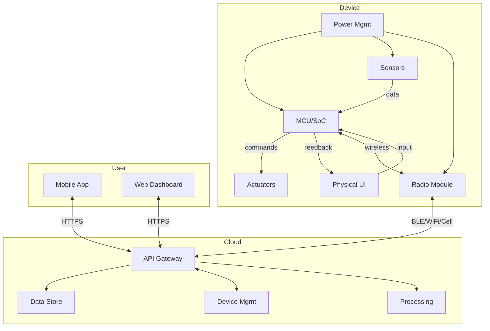
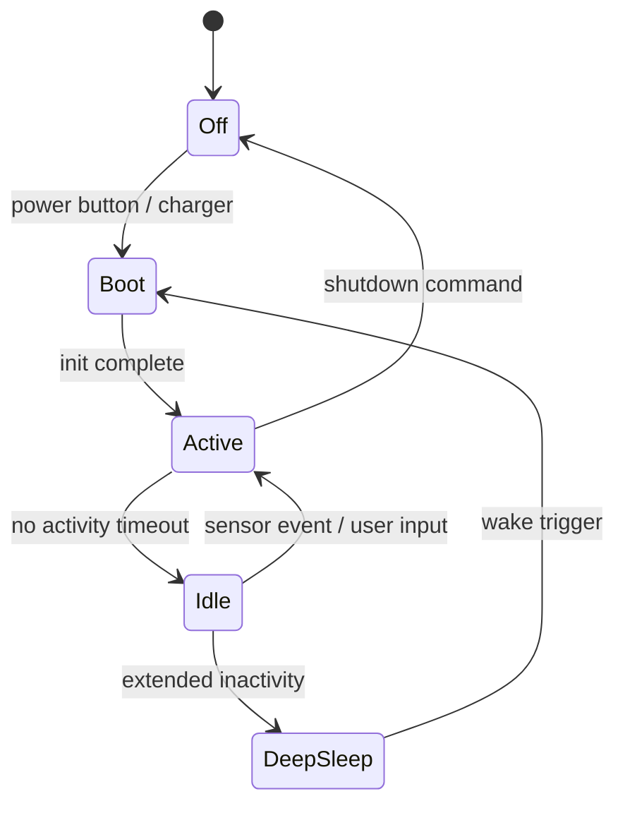

# System Description: [Product Name]

| Field | Value |
|-------|-------|
| Version | 0.1 |
| Date | YYYY-MM-DD |
| Author | |
| Status | Draft / In Review / Approved |
| Related docs | [Concept doc], [PRD when created] |

---

## 1. Product Vision and Context

*What is this product, who is it for, and what problem does it solve?*

> - What is the single sentence that explains this product to a new team member?
> - What existing products or behaviors does this replace or augment?
> - What is the deployment environment (indoor/outdoor, consumer/industrial, supervised/unattended)?
> - What does success look like — how will you know this product is working?

**Product statement:**
[One sentence: For [target user], [product name] is a [category] that [key benefit]. Unlike [alternative], it [differentiator].]

**Problem:**
[2-3 sentences on the problem being solved]

**Deployment context:**
- Environment: [indoor / outdoor / both]
- Setting: [home / office / industrial / field / vehicle]
- User type: [consumer / professional / mixed]
- Installation: [self-installed / professional install / none]
- Expected lifespan: [years]

---

## 2. User Scenarios

*3-5 concrete scenarios grounded in real use. Not abstract use cases — specific people, situations, actions, and outcomes.*

> - Walk through a day in the life of your primary user with this device.
> - What is the most common interaction? The most critical?
> - What happens when things go wrong (low battery, lost connection, sensor failure)?
> - What does the first-time experience look like, from unboxing to first value?

### Scenario 1: [Name]
**Persona:** [Who]
**Situation:** [Context and trigger]
**Action:** [What they do with the product]
**Outcome:** [What happens, what value they get]

### Scenario 2: [Name]
**Persona:** [Who]
**Situation:** [Context and trigger]
**Action:** [What they do with the product]
**Outcome:** [What happens, what value they get]

### Scenario 3: [Name — error/edge case]
**Persona:** [Who]
**Situation:** [Something goes wrong]
**Action:** [What the system does, what the user sees]
**Outcome:** [Recovery, degraded operation, or user action needed]

---

## 3. System Architecture

*Block diagram level. Show every major subsystem and the interfaces between them. This is the spine of the document — every other section elaborates on a block or connection here.*

> - Can you draw a block diagram with 5-10 blocks that covers the whole system?
> - What are the data flows? What moves between blocks and at what rate?
> - Where are the trust boundaries?
> - What is the simplest version of this diagram that is still accurate?

**Edit the diagram above to match your product. Add, remove, or rename blocks as needed.**

**Architecture narrative:**
[2-3 paragraphs explaining the diagram: what each major block does, how data flows through the system, and the key architectural choices visible in the diagram.]

---

## 4. Subsystem Descriptions

### 4.1 Hardware Subsystem

> - What is the most constrained resource on this board (GPIO pins, memory, power)?
> - What components have long lead times or single-source risk?
> - Is this one PCB or multiple? Why?

**MCU / SoC:**
- Part: [e.g., nRF52840, ESP32-S3, STM32L4]
- Selection rationale: [why this one]
- Key specs: [clock, RAM, flash, peripherals that matter]

**Sensors:**
| Sensor | Measures | Interface | Sample Rate | Key Spec |
|--------|----------|-----------|-------------|----------|
| | | | | |

**Actuators:**
| Actuator | Function | Interface | Key Spec |
|----------|----------|-----------|----------|
| | | | |

**Physical UI elements:**
- Buttons: [count, type (tact, capacitive)]
- LEDs: [count, colors, purpose]
- Display: [type, size, resolution] or N/A
- Other: [speaker, haptic, etc.]

**PCB strategy:**
[Single board / modular / flex-rigid. Approximate dimensions. Key placement constraints (antenna keep-out, sensor placement).]

### 4.2 Firmware Subsystem

> - What processing happens on-device vs. in the cloud? Why?
> - How does the device recover from a failed firmware update?
> - What is the boot-to-ready time target?

**Architecture:**
- OS/framework: [bare-metal / FreeRTOS / Zephyr / embedded Linux]
- Rationale: [why this choice]

**Major modules:**
| Module | Responsibility | Inputs | Outputs |
|--------|---------------|--------|---------|
| Sensor manager | | | |
| Connectivity | | | |
| Power manager | | | |
| Application logic | | | |
| OTA updater | | | |

**OTA update strategy:**
- Method: [A/B partition / differential / full image]
- Delivery: [pull / push, over which link]
- Rollback: [automatic on failure? how?]
- Signing: [firmware image signing approach]

**On-device processing:**
[What computation happens locally: filtering, averaging, thresholds, ML inference, etc. Why is this done on-device rather than in the cloud?]

### 4.3 Mobile / Companion App Subsystem

> - What can the user do without the app? What requires the app?
> - Is the app required for setup, or is there an alternative?
> - What platforms? Native or cross-platform?

**Platform:** [iOS / Android / both] — [native / React Native / Flutter / other]

**Core screens and flows:**
1. Onboarding / pairing
2. Dashboard / primary view
3. Settings / configuration
4. [Other key screens]

**Device communication:**
- Protocol: [BLE GATT / WiFi direct / cloud-mediated]
- Key services/characteristics or API endpoints:

| Service | Purpose | Direction |
|---------|---------|-----------|
| | | |

### 4.4 Cloud / Backend Subsystem

> - What is the data path from sensor reading to user-visible insight?
> - What happens when the cloud is unreachable?
> - What is the expected data volume per device per day?

**Infrastructure:**
- Platform: [AWS IoT / Azure IoT Hub / GCP IoT / custom / hybrid]
- Key services used: [list]

**Device provisioning:**
[How devices are registered. Certificate or token-based. Factory provisioning vs. user-initiated.]

**Data model:**
| Data Type | Source | Rate | Retention | Purpose |
|-----------|--------|------|-----------|---------|
| | | | | |

**Device management:**
- Shadow/twin: [yes/no, what state is synced]
- Remote commands: [what can be triggered from cloud]
- Fleet monitoring: [what metrics, alerting]

**Third-party integrations:**
[APIs, webhooks, partner services, IFTTT, etc.]

---

## 5. Interfaces

*Every connection between subsystems, specified explicitly. If it's not in this table, it doesn't exist.*

> - List every wire, bus, and wireless link in the system.
> - Which interfaces are standard and which are custom?
> - What is the failure mode for each interface?

### Internal Interfaces (within device)

| Interface | From | To | Protocol | Data | Rate | Notes |
|-----------|------|----|----------|------|------|-------|
| | | | I2C / SPI / UART / GPIO / ADC | | | |

### External Interfaces (device to outside world)

| Interface | From | To | Protocol | Data | Rate | Notes |
|-----------|------|----|----------|------|------|-------|
| | | | BLE / WiFi / Cell / USB / etc. | | | |

### Physical Connectors

| Connector | Purpose | Type | Notes |
|-----------|---------|------|-------|
| | Charging | USB-C / pogo / wireless | |
| | Debug | SWD / UART / Tag-Connect | |
| | Expansion | | |

---

## 6. Power Architecture

*Power is a first-class subsystem. For battery-operated devices, the power budget often determines what is architecturally possible.*

> - What is the power budget in the most common operating mode?
> - What wakes the device from sleep?
> - What is the target battery life and is it achievable with this architecture?

**Power source:**
- Type: [LiPo / LiFePO4 / primary cell / mains / USB / energy harvest]
- Capacity: [mAh] or N/A for mains
- Charging: [USB-C / wireless / solar / N/A]

**Power states:**

**Edit the state diagram above to match your product's power states and transitions.**

| State | MCU | Radio | Sensors | UI | Typical Duration |
|-------|-----|-------|---------|----|-----------------:|
| Active | Running | Tx/Rx | Sampling | On | |
| Idle | Low-power | Off / Advertising | Polling | Off | |
| Deep Sleep | Retention | Off | Off | Off | |
| Off | Off | Off | Off | Off | |

**Power budget (primary operating mode):**

| Component | Active | Idle | Deep Sleep | Unit |
|-----------|-------:|-----:|-----------:|------|
| MCU | | | | mA |
| Radio | | | | mA |
| Sensors | | | | mA |
| Actuators | | | | mA |
| Other | | | | mA |
| **Total** | | | | **mA** |

**Target battery life:** [X days/months at Y usage profile]

**Feasibility check:** [Back-of-envelope calculation: capacity / average current = hours. Does it meet the target?]

---

## 7. Connectivity Architecture

> - What is the worst-case network environment this device must handle?
> - How much data is transmitted per day? What is the payload structure?
> - What happens when the connection drops mid-transmission?

**Primary connectivity:**
- Technology: [BLE 5.x / WiFi / LTE-M / NB-IoT / LoRa / Thread / other]
- Rationale: [why this choice — power, range, cost, bandwidth, ecosystem]

**Fallback / secondary connectivity:** [if any]

**Protocol stack:**

| Layer | Technology |
|-------|-----------|
| Physical | [BLE / WiFi / Cell] |
| Transport | [TCP / UDP / CoAP] |
| Application | [MQTT / HTTPS / custom] |
| Security | [TLS 1.3 / DTLS] |

**Data transmission:**
- Frequency: [continuous / periodic / event-driven]
- Payload: [typical size, format (JSON, protobuf, CBOR)]
- Daily volume: [estimate per device]

**Provisioning and pairing:**
[Step-by-step: how does a new device get connected for the first time? BLE pairing → WiFi credentials → cloud registration, etc.]

**Offline behavior:**
[What happens when connectivity is lost. Local storage? Queuing? Degraded functionality? User notification?]

---

## 8. Key Technical Decisions and Trade-offs

*Document the "why" behind non-obvious choices. These are the decisions a new team member would question — explain them here so the rationale survives.*

> - What are the 3 decisions that, if reversed, would require a major redesign?
> - Where did you trade cost for performance, or vice versa?
> - What did you explicitly decide NOT to do, and why?

### Decision 1: [Title]
- **Options considered:** [A, B, C]
- **Chosen:** [B]
- **Rationale:** [Why B over A and C]
- **Consequences:** [What this enables, what it constrains]
- **Risks:** [What could make this the wrong choice]

### Decision 2: [Title]
- **Options considered:**
- **Chosen:**
- **Rationale:**
- **Consequences:**
- **Risks:**

### Decision 3: [Title]
- **Options considered:**
- **Chosen:**
- **Rationale:**
- **Consequences:**
- **Risks:**

---

## 9. Constraints

> - What constraint, if relaxed, would most change this architecture?
> - Which constraints are firm (regulatory, physics) vs. soft (budget, timeline)?

### Regulatory
- Required certifications: [FCC, CE, IC, Bluetooth SIG, WiFi Alliance, etc.]
- Known certification challenges: [antenna, power levels, battery]
- Target markets: [countries/regions]

### Environmental
- Operating temperature: [min °C to max °C]
- Storage temperature: [min °C to max °C]
- Ingress protection: [IP rating]
- Other: [vibration, shock, UV, humidity, altitude]

### Cost
- Target BOM cost: [$X at Y volume]
- Target retail price: [$Z]
- Target margin: [X%]
- Key cost drivers: [what eats the budget]

### Manufacturing
- Target annual volume: [units]
- Assembly complexity: [SMT only / mixed / manual steps]
- Test requirements: [functional test, calibration, burn-in]
- Target factory yield: [%]

### Schedule
- Key milestones: [prototype, EVT, DVT, PVT, mass production]
- Hard deadlines: [trade shows, seasonal windows, partner commitments]
- Certification timeline: [lead time for FCC/CE/etc.]

### Dependencies
- Third-party modules: [connectivity module, sensor modules]
- SDKs: [BLE stack, cloud SDK, RTOS]
- Cloud services: [what the product depends on]
- Partner APIs: [external integrations]

---

## 10. Open Questions and Risks

*Be honest about what you don't know yet. An open question with an owner and a deadline is better than a hidden assumption.*

> - What are you least confident about in this system description?
> - What needs a prototype or proof-of-concept before committing?
> - Where are you making assumptions that haven't been validated?

| # | Question / Risk | Category | Impact | Owner | Target Date | Status |
|---|----------------|----------|--------|-------|-------------|--------|
| 1 | | Technical / Cost / Regulatory / Schedule | H / M / L | | | Open |
| 2 | | | | | | |
| 3 | | | | | | |

---

## Appendix

### Glossary
| Term | Definition |
|------|-----------|
| | |

### Reference Documents
| Document | Location | Relevance |
|----------|----------|-----------|
| | | |

### Revision History
| Version | Date | Author | Changes |
|---------|------|--------|---------|
| 0.1 | | | Initial draft |
